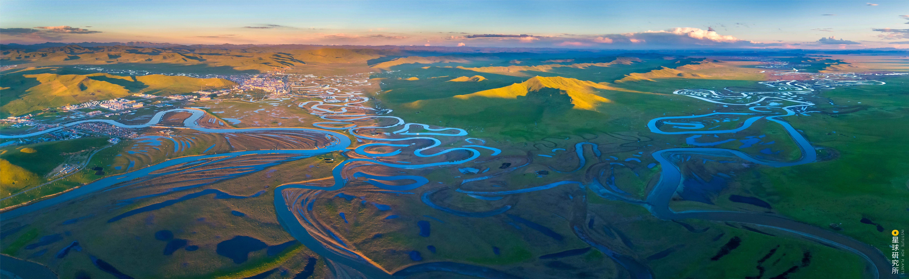

<h1 align="center">水资源与防洪研究所资源共享</h1>

  
 
  

      <a href="https://github.com/iHeadWater/WaterResources/forks">
        
      
      
     

  

    
本项目仓库主要由大连理工大学水资源与防洪研究所（Dalian University of Technology institute of Water Resources and flood control）模型源平台组负责维护与更新，并定期为研究所成员推送最新资源信息，旨在分享本研究所模型与数据的研究以及应用成果，可在此基础上，构建符合大规模数据处理分析与复杂计算需求的通用以及专业模型算法，在增加模型源平台内容建设的同时，为各方向产品及服务的完整解决方案构建提供必要技术支撑。
  
## 项目简介

本项目是研究所学生培养、科学研究以及工程应用的大本营。研究所目前包括水资源综合调控、流域水文、流域水生态、城市水务四大研究方向，并有专门的水利数字化团队提供技术支持，相应地，本项目仓库内容也由多位来自这些研发方向的研究室老师和同学贡献，汇集了各方向的通用模型和算法、自主研发的专业模型、国内外的流行或经典模型、外部与内部数据建设、教程与文献系列、典型研究与工程案例，有助于研究所成员快速了解模型与数据的研究以及应用成果，并基于提供的各方向研究和开发中常用以及典型案例的数据与模型访问接口，快速构建实际项目和论文选题的模型解决方案。

## 目录

- [相关列表](#相关列表)
- [书籍](#书籍)
- [软件](#软件)
  - [模型](#模型)
  - [数据](#数据)
  - [APP](#APP)
- [教程](#教程)
- [视频](#视频)
- [文献](#文献)
- [博客](#博客)

## 相关列表
- [open-sustainable-technology](https://github.com/iHeadWater/open-sustainable-technology) - 精选的开放技术项目列表，旨在维持稳定的气候、能源供应、生物多样性和自然资源
- [awesome-open-hydrology](https://github.com/iHeadWater/awesome-open-hydrology) - 开放的水文相关项目列表

## 书籍
- [水资源图书馆](https://github.com/iHeadWater/WaterResources/blob/master/WaterResourcesBooks.md) - 推荐各方向及相关领域的优秀专著
- [d2l-zh](https://github.com/iHeadWater/d2l-zh) - 有关深度学习的一本书，包含概念、背景知识和代码

## 软件

### 模型
- [station-simulator](https://github.com/iHeadWater/station-simulator) - 一种从模拟站点和河网图层文件（SHP）中判断站点上下游关系的简单办法
- [seq2seq_streamflow_prediction](https://github.com/iHeadWater/seq2seq_streamflow_prediction) - 利用seq2seq模型实现降雨径流预报
- [Hydro-model-xaj](https://github.com/iHeadWater/hydro-model-xaj) - 新安江模型的 Python 实现
- [eWaterCycle](https://github.com/iHeadWater/ewatercycle) - 用于运行水文模型的 Python 包

### 数据
- [hydro-opendata](https://github.com/iHeadWater/hydro-opendata/tree/main) - 可用于水文学科学计算的开放数据的获取、管理和使用路径及方法

### APP
- [PA4Water](https://github.com/iHeadWater/PA4Water) - 使用人工智能工具来帮助水科学和工程研究和项目的开发项目

## 教程
- [hydroGIS](https://github.com/iHeadWater/hydroGIS) - GIS工具的使用，包括ArcGIS、AutoGIS、GEE、QGIS
- [hydrus](https://github.com/waterDLut/hydrus) - 水文水资源研究和应用中使用Python的基础教程
- [hydro-dl-tutorials](https://github.com/waterDLut/hydro-dl-basic) - 介绍深度学习的基础概念等
- [iheadwater_hackweek_tutorials](https://github.com/iHeadWater/iheadwater_hackweek_tutorials) - 水资源科研编程入门教程

## 视频

## 文献
- [papers](https://github.com/iHeadWater/WaterResources/tree/master/papers) - 以主题的形式分享记录一些文献简述

## 博客
- [水资源云课堂](https://github.com/iHeadWater/WaterResources/blob/be1024c24cf5956bc5a3a4d6ff5aab2b22d1fe9b/WaterResourcesWeb.md) - 推荐各方向研究所需基础技术栈的相关资料
## 一起贡献

如果您想参与贡献，但不知道怎么使用 git/github/jupyterlab/markdown 等基本工具来完成编辑工作，请参考[这里](https://github.com/waterDLut/WaterResources/blob/master/tools/writing-tool.md)

如果您想提供一些建议，可直接联系 [waterDLut](https://github.com/waterDLut) 任意成员。
