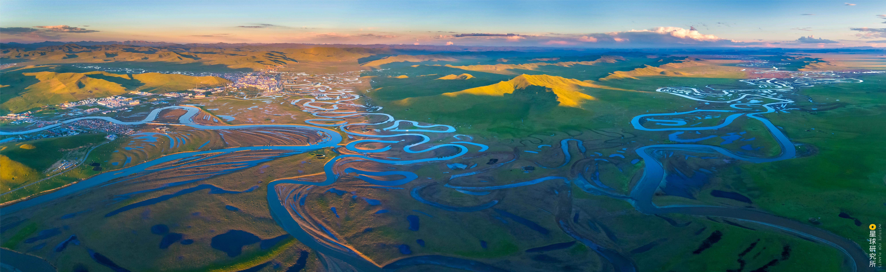

<h1 align="center">水资源与防洪研究所资源共享</h1>

  
 
  

      <a href="https://github.com/iHeadWater/WaterResources/forks">
        
      
      
     

  

    
本项目仓库（以下简称repo）主要由大连理工大学水资源与防洪研究所（Dalian University of Technology institute of Water Resources and flood control）模型源平台组负责维护与更新，并定期为研究所成员推送最新资源信息，旨在分享本研究所模型与数据的研究以及应用成果，可在此基础上，构建符合大规模数据处理分析与复杂计算需求的通用以及专业模型算法，在增加模型源平台内容建设的同时，为各方向产品及服务的完整解决方案构建提供必要技术支撑。
  
## 项目简介

本项目是研究所学生培养、科学研究以及工程应用的大本营。研究所目前包括水资源综合调控、流域水文、流域水生态、城市水务四大研究方向，并有专门的水利数字化团队提供技术支持，相应地，本repo内容也由多位来自这些研发方向的研究室老师和同学贡献，汇集了各方向的通用模型和算法、自主研发的专业模型、国内外的流行或经典模型、外部与内部数据建设、教程与文献系列、典型研究与工程案例，有助于研究所成员快速了解模型与数据的研究以及应用成果，并基于提供的各方向研究和开发中常用以及典型案例的数据与模型访问接口，快速构建实际项目和论文选题的模型解决方案。

## 目录

- [通用模型和算法](#通用模型和算法)
  - [station-simulator](#station-simulator)
  - [seq2seq_streamflow_prediction](#seq2seq_streamflow_prediction)
- [国内外的流行或经典模型](#国内外的流行或经典模型)
  - [Hydro-model-xaj](#Hydro-model-xaj)
  - [eWaterCycle](#eWaterCycle)
- [外部与内部数据建设](#外部与内部数据建设)
  - [hydro-opendata](#hydro-opendata)
- [教程与文献系列](#教程与文献系列)
  - [DUTWR-文献概述](#DUTWR-文献概述)
  - [d2l-zh](#d2l-zh)
  - [hydroGIS](#hydroGIS)
  - [hydrus](#hydrus)
  - [hydro-dl-tutorials](#hydro-dl-tutorials)
  - [iheadwater_hackweek_tutorials](#iheadwater_hackweek_tutorials)
  - [科研随笔](#科研随笔)
- [典型研究与工程案例](#典型研究与工程案例)
  - [PA4Water](#PA4Water)

## 通用模型和算法
本部分内容包括也由多位来自这些不同研究或研发方向的同学（目前主要是利用机器学习解决水相关问题的[学习小组](https://github.com/waterDLut)成员）贡献，目前主要包括以下内容（逐步更新中）
### [station-simulator](https://github.com/iHeadWater/station-simulator)
一种从模拟站点和河网图层文件（SHP）中判断站点上下游关系的简单办法。

### [seq2seq_streamflow_prediction](https://github.com/iHeadWater/seq2seq_streamflow_prediction)
*更新中*

## 国内外的流行或经典模型
### [Hydro-model-xaj](https://github.com/iHeadWater/hydro-model-xaj)
Hydro-model-xaj 是新安江 (XAJ) 模型的 Python 实现，该模型是最著名的概念水文模型之一。非正式版，仅供学习（因作者技术水平和时间紧迫的客观条件，可能存在错误）

### [eWaterCycle](https://github.com/iHeadWater/ewatercycle)
用于运行水文模型的 Python 包，eWaterCycle 软件包使使用水文模型变得更加容易，而无需深入了解如何安装和运行模型。

## 外部与内部数据建设
### [hydro-opendata](https://github.com/iHeadWater/hydro-opendata/tree/main)
可用于水文学科学计算的开放数据的获取、管理和使用路径及方法。
- [数据获取](https://github.com/iHeadWater/hydro-opendata/tree/main/data_api) - 获取遥感数据的示例。
- [数据目录](https://github.com/iHeadWater/hydro-opendata/tree/main/data_catalog) - 部分开放数据的数据来源、空间范围和时间范围等信息。
- [数据下载](https://github.com/iHeadWater/hydro-opendata/tree/main/data_downloader)- 提供通用下载器和部分数据的下载功能。

## 教程与文献系列

### DUTWR 文献概述
本部分不完全按照研究方向分类，主要以每篇博客的主题分类，*仍在开发中*，可查看[这里](https://github.com/waterDLut/WaterResources/tree/master/papers); 

### [d2l-zh](https://github.com/iHeadWater/d2l-zh)
有关深度学习的一本书，包含概念、背景知识和代码；并阐述剖析问题所需的批判性思维、解决问题所需的数学知识，以及实现解决方案所需的工程技能。

### [hydroGIS](https://github.com/iHeadWater/hydroGIS)
水文水资源的科研和工程实践中一定缺不了GIS工具的使用，熟悉一些常用GIS工具十分有必要，这里记录平时一些实践备查。
- [ArcGIS](https://github.com/iHeadWater/hydroGIS/tree/master/ArcGIS) - ArcGIS使用介绍。
- [AutoGIS](https://github.com/iHeadWater/hydroGIS/tree/master/AutoGIS) - 了解Python GIS 常用的开源库以及实例计算。
- [GEE](https://github.com/iHeadWater/hydroGIS/tree/master/GEE) - GEE python接口尤其是geemap的使用。
- [QGIS](https://github.com/iHeadWater/hydroGIS/tree/master/QGIS) - 免费版ArcGIS。

### [hydrus](https://github.com/waterDLut/hydrus)
水文水资源（Hydrology and Water Resources）研究和应用中使用Python的基础教程。
- Python基础
  - [基础环境配置](https://github.com/iHeadWater/hydrus/tree/master/1-basic-envir) - 了解python前的准备。
  - [python基础](https://github.com/iHeadWater/hydrus/tree/master/1-learn-python) - 熟悉python语法、调试等。
- 常用科学计算库  
  - [NumPy](https://github.com/iHeadWater/hydrus/tree/master/2-numpy-examples) - 存储和处理大型矩阵的科学计算库--N维数组容器。
  - [pandas](https://github.com/iHeadWater/hydrus/tree/master/2-pandas-examples) - 基于 NumPy 的一种工具，强大而高效的数据分析环境--表格容器。
  - [scipy](https://github.com/iHeadWater/hydrus/tree/master/2-scipy-example) - 用于数学、科学、工程领域的常用软件包--科学计算函数库。
  - [xarray](https://github.com/iHeadWater/hydrus/tree/master/2-xarray-example) - 结合了NumPy多维数据和pandas标记的一个工具。
- 可视化
  - [静态可视化](https://github.com/iHeadWater/hydrus/tree/master/3-basic-pyviz) - matplotlib和seaborn的使用。
  - [GIS数据可视化](https://github.com/iHeadWater/hydrus/tree/master/3-gis-pyviz) - Cartopy和geoplot工具的使用。
  - [交互式可视化](https://github.com/iHeadWater/hydrus/tree/master/3-interactive-pyviz) - bokeh和plotly的使用。

### [hydro-dl-tutorials](https://github.com/waterDLut/hydro-dl-basic)
本部分介绍深度学习的基础概念等，后续根据[学习小组](https://github.com/waterDLut)实际推进情况逐步更新。 
 - [基本常识](https://github.com/iHeadWater/hydro_dl_tutorials/tree/main/0-common-sense) - 人工智能、机器学习、深度学习等基本概念。
 - [常见基本神经网络](https://github.com/iHeadWater/hydro_dl_tutorials/tree/main/1-simple-NN) - ANN、RNN、CNN等常见结构。
 - [常用深度学习工具](https://github.com/iHeadWater/hydro_dl_tutorials/tree/main/2-tool-pytorch) - PyTorch。
 - [更多基本概念](https://github.com/iHeadWater/hydro_dl_tutorials/tree/main/3-more-knowledge) - 权重初始化、自动微分等概念。
 - [更多常用神经网络](https://github.com/iHeadWater/hydro_dl_tutorials/tree/main/4-more-NN) - 更复杂的RNN、CNN等结构。
 - [其他深度学习范式](https://github.com/iHeadWater/hydro_dl_tutorials/tree/main/5-more-pattern) - 强化学习、迁移学习等。
 - [模型解释方法](https://github.com/iHeadWater/hydro_dl_tutorials/tree/main/6-XAI-methods) - 解释深度学习模型的方法。
 - [模型不确定性](https://github.com/iHeadWater/hydro_dl_tutorials/tree/main/7-DL-uncertainty) - 概率预报等。
 - [更多工具使用](https://github.com/iHeadWater/hydro_dl_tutorials/tree/main/8-more-tools) - 模型解释工具、超参数优化工具等。

### [iheadwater_hackweek_tutorials](https://github.com/iHeadWater/iheadwater_hackweek_tutorials)
水资源科研编程入门教程，网页在这里：https://iheadwater.github.io/iheadwater_hackweek_tutorials
### 科研随笔
本部分记录科研方式方法等一些比较个人经验化的内容，分享对学习、研究中面临的各类问题的看法、想法，*仍在开发中*，可查看[这里](https://github.com/waterDLut/WaterResources/tree/master/notes)；

## 典型研究与工程案例
### [PA4Water](https://github.com/iHeadWater/PA4Water)
尝试利用AI工具构建一个水利科研和工程的私人助手。

## 一起贡献

如果您想参与贡献，但不知道怎么使用 git/github/jupyterlab/markdown 等基本工具来完成编辑工作，请参考[这里](https://github.com/waterDLut/WaterResources/blob/master/tools/writing-tool.md)

如果您想提供一些建议，可直接联系 [waterDLut](https://github.com/waterDLut) 任意成员。
