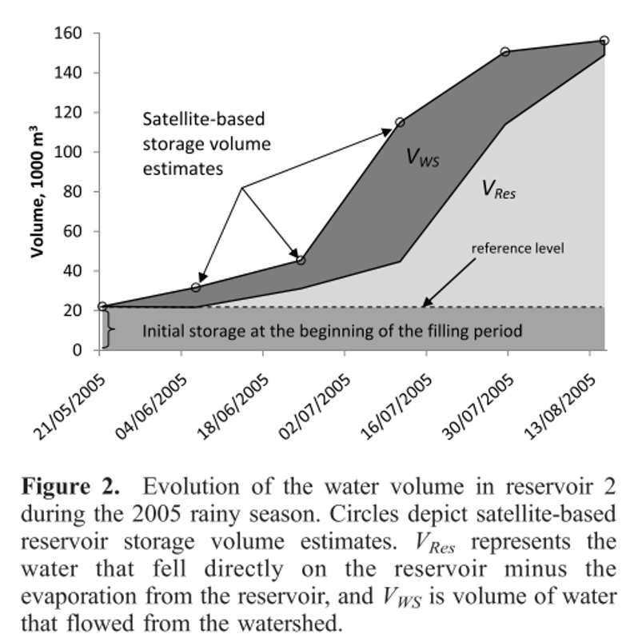
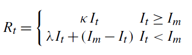
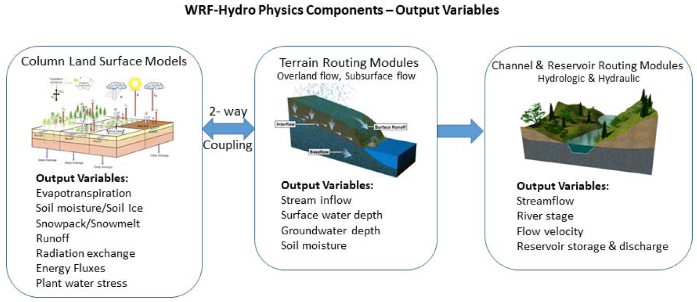
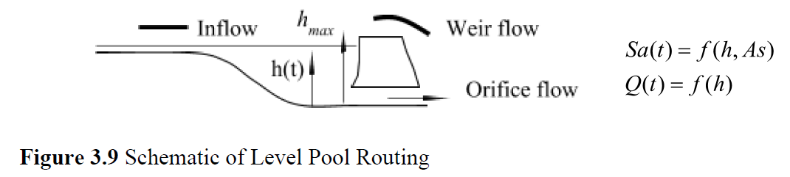
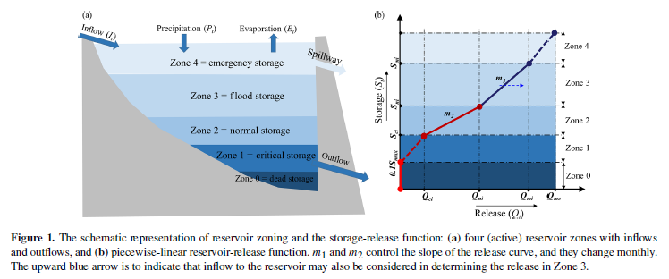
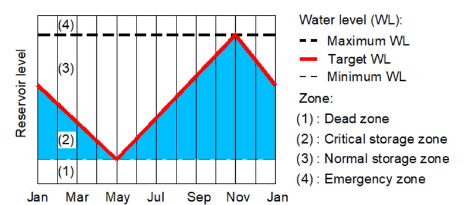
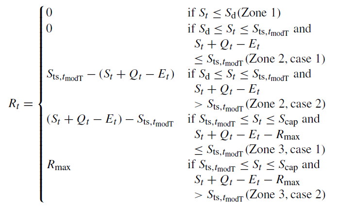
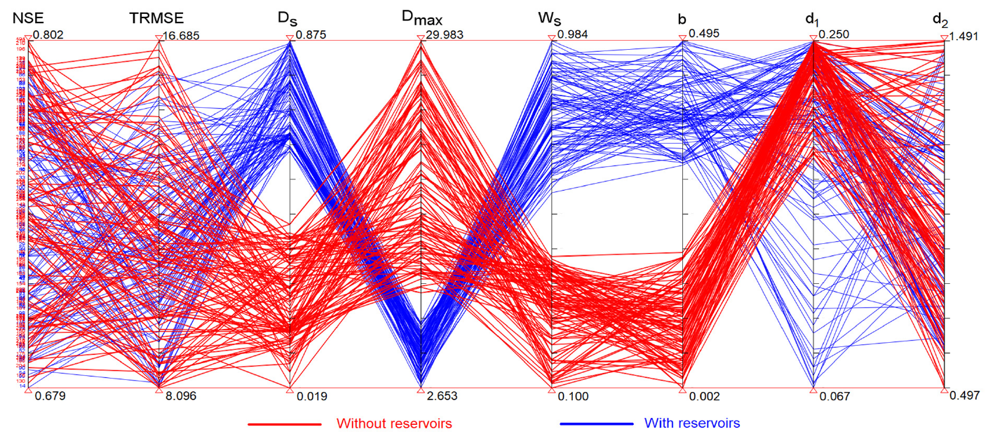
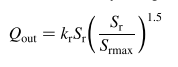
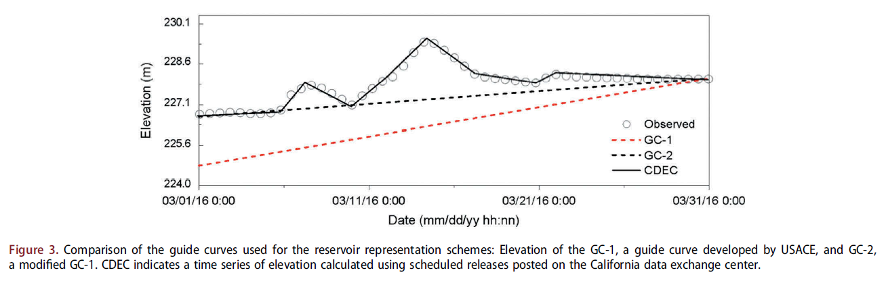

# Streamflow Prediction in Dammed Basins

本文简单review关于 Streamflow Prediction in Dammed Basins（SPDB）问题相关的文献。

按刊出时间顺序，简单记录一些 SPDB 相关的文献要点，以下是部分文章的结果小结。

- Hanasaki et al. (2006)：no NSE, The results of this paper consist of two parts: one is for individual reservoir simulation, and the paper showed the performance of simulated releases for 18 in 28 reservoirs were better when using the operation schems in this paper; the other is for global reservoir simulation, which was tested on discharges of 84 river gauge stations. The 2-year simulation results showed no improvement for global simulation.
- Payan et al. (2008): they used NSE of sqrt{Q} as their criterion, the mean NSq rises from 0.679 to 0.707 from ignoring storage information to considering those;
- Wu and Chen (2012): https://doi.org/10.1175/JHM-D-10-05028.1 The authors developed a reservoir operation scheme to decide outflow and its distribution on hydropower, water supply and impoundment purposes according to the inflow and storage, calibrated the coefficients of equations in the new scheme during 1965-1984 and validated the scheme in the period 1987-1988 for the xinfengjiang reservoir in the East River basin in southern China. The results showed the NSE of outflow could reach 0.36, while the NSE values of the two baselinw schemes were 0.13 and 0.21. One baseline scheme is the original SWAT reservoir module and the other is multilinear regression between storage variation and storage, inflow.
- Zhang et al. (2012): https://doi.org/10.5194/hess-16-4033-2012  The authors modified the original SWAT reservoir module by using Landsat, an empirical storage classification method, and  empirical reservoir/ponds storage-release relationships to estimate water storage and release for the flow detention and regulation facilities with various sizes. The results showed that the improved SWAT model more accurately modeled small- and medium-sized storages than the original model when reproducing streamflows in the Fengman watershed in northeastern China,  improveing NSE values from 0.814 to 0.855, 0.656 to 0.841, 0.864 to 0.885, and 0.822 to 0.941 for four hydrologic stations;
- Viosin et al. (2013): The authors used different predictors and reservoir operation priorities to modify the equations of reservoir schemes in Hanasaki (2006). For simulated 1983/10 to 1999/09 monthly regulated flow, the best performance shown in this paper was a NSE of 0.62 for the Dalles location in the outlet of the columbia river basin, while NSEs of the other two locations are still negative;
- Ehsani et al. (2016): The authors used artificial neural networks to map the general relationships between daily release and daily reservoir storage volume, three consecutive days of inflow, and release in the past 2 days. Based on experiments for 12 dams, the average Nash efficiency coefficient for simulation of a daily reservoir release time series could reach a high value of 0.86;
- Zhao (2016): https://doi.org/10.1016/j.advwatres.2016.10.014 In this paper, a multi-purpose reservoir module with predefined complex operational rules was integrated into the Distributed Hydrology Soil Vegetation Model (DHSVM). Conditional operating rules, which are designed to reduce flood risk and enhance water supply reliability, were adopted in this module. The performance of the integrated model was tested over the upper Brazos River Basin in Texas, where two U.S. Army Corps of Engineers managed reservoirs, Lake Whitney and Aquilla Lake, are located. The integrated model was calibrated and validated using observed reservoir inflow, outflow, and storage data. The error statistics were summarized for both reservoirs on a daily, weekly, and monthly basis: the Nash-Sutcliff Efficiency (NSE) of releases were 0.74, 0.81 and 0.92 for Lake Whitney and 0.51, 0.51 and 0.63 for Aquilla Lake;
- Zajac (2017): http://dx.doi.org/10.1016/j.jhydrol.2017.03.022 The authors estimated the effect of lakes and reservoirs on global daily streamflow simulations of a spatially distributed LISFLOOD hydrological model. With lakes and reservoirs, the NSE values of simulated daily streamflow for 390 stations during 1980-2013 were improved for 65% of the catchments with a median improvement of 0.16. The best NSE value shown in this paper occured in Norilka At Valek station, the value could reach 0.61 when integrating lakes and reservoirs modules;
- Coerver et al. (2018): https://doi.org/10.5194/hess-22-831-2018 In this paper, using an artificial neural network capable of mimicking fuzzy logic, called the adaptive-network-based fuzzy inference system (ANFIS), fuzzy rules linking inflow and storage with reservoir release were determined for 11 reservoirs in central Asia, the US and Vietnam. The derived rules were used to simulate reservoir monthly release with an average NSE of 0.81;
- Shin et al. (2019): the authors enhanced the generic reservoir operation scheme of Hanasaki et al. (2006) in the routing scheme of a hydrologic model, and developed a high‐resolution continental‐scale reservoir scheme for storage and release dynamics which could improve simulations. This scheme has made great progress in analyzing the impacts of dams on river discharge over the conterminous United States (CONUS), and obtained a correlation of 0.61 about reservoir release between observations and predictions for a reservoir in the Sacramento river;
- Yassin et al. (2019): the authors developed a general parametric reservoir operation model based on piecewise-linear relationships between reservoir storage, inflow, and release to approximate actual reservoir operations. This was built into a land surface model, which was tested in 37 reservoirs across the globe. Results showed the NSE for daily or monthly release flow was greater than 0.25 and 0.5 for 90% and 50% of reservoirs with generalized parameters, respectively, while models with no-reservoir assupmtion resulted in NSE values of greater than 0.25 and 0.5 for 45% and 30% of reservoirs, respectively. The proposed model in this paper has some parameters that can vary for different times of the year. When inflow, storage variation and release data are all avialible, these parameters could be calibrated to fit the target variables. Relative to the generalized solution, calibrated parameters improved NSE flow for all reservoirs, with a median improvement of 0.11; 
- Dang et al. (2020): https://doi.org/10.5194/hess-24-397-2020 The authors provided a novel variant of VIC’s routing model to simulate the storage dynamics of water reservoirs. Using the upper Mekong river basin as a case study, they calibrate the instance of VIC with reservoirs over the period 1996–2005 and show that the model has a NSE range of 0.68-0.79 for reproducing daily discharges in this period.
- Kim et al. (2020): The authors developed an integrated water management model, NWM-ResSim, by coupling the NWM with HEC-ResSim, and two reservoir representation schemes are tested: simulation of reservoir operations and retrieval of scheduled operations. The experiments focus on a pilot reservoir domain in the Russian River basin – Lake Mendocino, California – and its contributing watershed. The reservoir representation schemes are evaluated for the 2016/17 wet season. Simulated monthly reservoir outflows by scheduled operations of the coupled model could produce positive NSE for all locations (not concrete values are shown).

## An Operation-Based Scheme for a Multiyear and Multipurpose Reservoir to Enhance Macroscale Hydrologic Models （2006）

这是这个领域很重要的一篇文章（Hanasaki 2006）。其目的也是把水库调度模块加入到routing model中更好地表达水文过程，进一步分析水库对径流的影响。考虑了全球452个水库，把它们放进了TRIP模型（一个全球河流汇流模型）的河网中。空间分辨率1度，时间是月尺度模拟。使用的输入有runoff数据，来自一个10天1度时空分辨率的水文模型JMA-SiB的结果。取水数据包括灌溉和非灌溉取水，前者是使用CROPWAT模型计算的结果，后者来自一篇文章0.5度月尺度数据。有28个水库的日或者月尺度的库容、入流、和泄流数据用来验证模拟结果。

水库模型本身的方法核心是对水库调度的规则性概化。三步：

首先定义一个下泄系数，
$$k_{rls,y}=\frac{S_{first,y}}{\alpha C}$$
它可以表达每个调度年之间的变化性。基本的逻辑是这样的，一年的总供水量很大程度上取决于初库容以及长期目标需水，长期目标水量用库容乘以一个系数表达，所以可以得到上式。

那么早期的关于第y年总release的初步假设值可以设为：
$$R_y \approx k_{rls,y} * i_{mean}$$

然后给出一个临时的月下泄值，但是对irrigation水库和non-irrigation的处理不同。

non-irrigation的比较简单，认为其不具备月际变化，所以直接把年均径流拿来用
$$r_{m,y}'=i_{mean}$$

对于irrigation的：
$$r_{m,y}' = \frac{i_{mean}}{2}*(\frac{\sum _{area}[k_{alc}*(d_{irg,m,y}+d_{ind}+d_{dom})]}{d_{mean}}) \ \ \ \ \ if\ d_{mean}\geq 0.5* i_{mean}$$
$$r_{m,y}' = i_{mean}+\sum{area}[k_{alc}*(d_{irg,m,y}+d_{ind}+d_{dom})]-d_{mean} \ \ \ \ \ \  otherwise$$
$$d_{mean}=\sum _{area}[k_{alc}*(d_{irg,mean}+d_{ind}+d_{dom})]$$

这里的基本逻辑是对于需水相对不多的情况，使用均值分配的方式初步分摊到各个月体现月内差异。对于需水相对较大的情况，应该使用一种类似hedging 的方式，可以看到$d_{mean}$的系数，计算下是小于1的，也就是分配到的需水并不都满足。

最后目标月下泄可以由下式计算：
$$r_{m,y}=k_{rls,y}*r_{m,y}' (c\geq 0.5)$$
$$r_{m,y} = (\frac{c}{0.5})^2 * k_{rls,y} * r_{m,y}'+[1-(\frac c {0.5})^2]i_{m,y} (otherwise)$$
这一部分主要是再考虑库容 来最后定义月下泄。库容系数c大，那么可以直接将初估的下泄乘以下泄系数即可，就如开始初设的年总下泄那样。库容系数小的时候可以看到类似hedging。

这三步公式的形式应该是作者根据数据反推出来的，总之，现在已经成为了很多研究的引用基础。

模拟方面。首先对水库的模拟，在28个有数据的水库上，以观测的月入流和初始库容为输入，根据上述模型计算出流和库容。

在global reservoir simulation，整体径流模拟方面，首先不考虑水库模块，启动global 模型，迭代输入global runoff field直到initial river channel storage达到equilibrium（没有太明白啥意思！！！需补充）。然后使用水库调度模块，再迭代输入global runoff field知道initial reservoir storage 达到equilibrium。接着就可以执行全模拟了。TRIP用来将每个网格的runoff 从headwater汇流到sea。当遇到有水库的grid，就从标准的汇流模块切换到水库模块。整个过程相当于是online（这个词在不同文章中意思应该有所区别，这里以Turner et al. 2020的文章中的意思为主）的。最后，使用Global River Discharge Center的数据来评价84个站点的RMSE，不过文章主要比较了有水库模拟和无水库模拟两种情况下RMSE的差别，并没有给出具体的数据，更多地是分析有无水库模拟对径流模拟的影响。

结果方面，没有给出太多具体的性能指标，更多的是比较RMSE。

水库模拟中，比较了有无水库以及不同水库模式模拟的RMSE的差异。文章给出的模式和其他更简单的水库模式或者无水库模式相比，在28个里面的18个都是最小的RMSE，25个是比无水库和natural lake模块都要好的。

整体径流模拟方面，如图11综合比较了全球84个径流站点的在有无水库模拟条件下的结果，结果显示，总体上看并没有明显地让径流模拟更好，但是模拟只有两年，所以结果也不能轻易得出。

## Anthropogenic impacts on continental surface water fluxes (2006)

这是该领域一篇比较经典的文章（Haddeland 2006）。文章通过在VIC模型中引入水库模型开展了continental-scale的模拟以研究水库和灌溉取水对大陆尺度地表水通量的影响。加入的水库模块能模拟灌溉需水，获取水库调度和灌溉取水对地表水通量的主要影响。比如结果显示，北美地区模拟的灌溉需水和耗水分别为191和98立方公里/年。

VIC模型里面的灌溉取水模块用的也是这位作者之前论文中的模型。forcing data北美是NLDAS数据（原文还有亚洲地区，这里主要以记录方法思路及部分性能结果为主，暂略对其阐述），时间日尺度，空间分辨率0.5度，模拟1980-1999共20年。灌溉面积信息来自另一篇文献，作物信息来自作者灌溉取水模块那篇文章。Dam信息从the International Commission on Large Dams (ICOLD) 等处获取，共633个全球最大的水库。

水库模块是一个generic reservoir model，在原routing model中实现。基于优化算法根据给定的水库入流、库容和下游需水情况来计算最优泄流。用的是单一水库的优化，不考虑梯级水库。模拟是在日尺度上进行。需水计算是在月尺度上，每个月内保持不变。

其中，入流（包括未来入流），从文章上看应该都是基于VIC模拟出的结果，因为前面讲输入的时候没有提到reservoir inflow的事，且在介绍reservoir model的时候，有提到reservoir inflow是simulated inflow。所以从水库模块和水文模型的耦合来看，算是online的。

从结果看，分析的是月尺度上的Simulated mean monthly runoff to the receiving oceans的结果，见原文图4，没有给出具体的指标。

## Calibrating a watershed simulation model involving human interference (2007)

这篇文章是[Calibrating a watershed simulation model involving human interference: an application of multi-objective genetic algorithms](https://doi.org/10.2166/hydro.2008.010)，其应用的方法是一种比较常见的在小范围内做人类活动影响的径流预报修正中使用的方法。这类方法处理问题的出发点是流域径流预报模型如何将水库运行的规律包含其中，然后通过率定的方式量化确定这种影响。

所以他面临的问题就可以归纳为：怎么在模型**预报和率定中考虑的水库运行**的规律。

在人类活动的影响方面，有一种分类方式如下：

- 对水文系统的特征的改变，包括land use，land cover；
- 对水文系统的动态冲击影响，比如水库下泄，取水，灌溉，回流等。

这篇文章主要考虑第二种影响，其主要思路是：

1. 用水库水位－流量关系定义水库运行；
2. 然后将由上述关系定义的水库泄流加入一个误差校正项中来率定模型。

具体方法上，作者用了一个分布式水文模型进行水文模拟计算，这个模型有水库汇流模块，水库用storage–release function based on the physical characteristics of the reservoir and dam 来模拟，可以显式地考虑水库的影响；模型率定方面，Minimizing the root-mean-square-error，Minimizing the deviation in runoff depth，Minimizing the deviation in peak flow magnitude和Minimizing the deviation in time to peak多目标，具体方法是MOGA算法；然后在模型中，认为为了应对需求，比如干旱缺水，防洪预泄等，调度操作会引起径流模拟的一个**误差项**$\epsilon (t)$，：
$$R(t)=R^*(t)+\epsilon (t)$$
具体地说，该误差项反映了：

- instant changes in streamflow and subsequently an abrupt change of the shape of the observed streamflow hydrograph triggered by human interference
- a systematic error with the storage–release function
- the aggregated effect of both

这不是一个随机误差项，是综合反映了多种误差的系统误差项，通过率定的方式去计算每个时段输出的误差项来表示这个系统误差。

结果上这里主要看看对比有没有上述误差项的区别。误差项原文指定了一个观测径流的比例上限，分别是0，5，10，20. 根据原文表3可以看到，有20%范围的误差项能更好修正模型预测。

总之，该文是将水库下泄作为一个系统误差来考虑，已获得更准确的率定模型，从结果上看是有必要的。

## How can man-made water reservoirs be accounted for in a lumped rainfall-runoff model (2008)

这篇文章**将水库考虑进了集总式模型中**。

以往直接研究这些影响的方式都是利用分布式模型，将水库纳入到模型的子单元中，通过显式地参数化这些变量到单元中，可以显式地考虑这些变量的影响。但这种方法有一定局限性，因为分布式模型所需的数据较多，很多时候没办法面面俱到，因此分布式模型的性能并没有体现出比集总式模型强大之处。但是将这种影响放入集总式模型中有一些难点：

- 在集总式模型中，dam的位置在流域上是较难考虑的；
- 另外，集总式模型多是达尔文式模型，比较难直接反映流域的物理信息，因此水库的影响很难定位到集总式模型中。

那么要如何考虑呢，首先看看水库对下游站点的影响可以由什么因素衡量？

- 从静态属性方面，The associated reservoirs also represent an interesting variety of characteristics in terms of：**volume, location within the watershed (close to or far from the outlet) and management objectives (flood control, low flow augmentation, irrigation, hydropower, water supply, etc.)**.

- 从动态影响看，Data collected to characterize the behavior of reservoirs are **daily time series of stored volumes (volumes are generally more widely available than detailed records of all the reservoir inflow and outflow series). 这些数据反映了水库管理的类型。 水库库容可以用水位库容曲线+水位的方式获取。水库径流输入也是重要因素，不过本文假设站点处没有径流测站。

然后在方法上，作者是这么考虑的：

1. 把流域上所有水库集总到流域尺度上，即一个水库的库容变化都等价为整个流域上；
2. 在水文模型中，将流域水库作为一个存储单元考虑，平均到流域整体；
3. 根据观测，将流域平均的动态库容水位变化(每个时段一个$\triangle V$)表达出来，不带参数，这就是真实反映实际调度的。

那么$\triangle V$加入到模型的哪个部分：The transfer function? The production function? Both?

这块就采用了“trial and error”的方式来进行判断，最后敲定了：

- If the stored volume variation $\triangle V$ is negative (i.e., the stored volume in reservoirs decreases), $\triangle V$ is added to the content of the routing store (见原文 Figure 3);
- If $\triangle V$ is positive (i.e., the stored volume increases), $\triangle V$ is subtracted from the content of the production store (见原文Figure 3).

这个方法不用改变参数，只是在模型计算过程中，**从模型的状态量中抽走/加入一部分水量**，这部分水量由聚合水库的库容变化值来确定。模型是online的。

数据上收集日尺度数据，对每个流域，包括：面雨量、平均气温曲线以计算蒸散发PE、下游测站径流，日尺度的水库库容（无水库入流）。收集了13年的连续数据。

初始的GR4J模型没有考虑水库模块，用来作为对比基准。大部分是法国的，在美国的三个站点里，有两个我是有数据的Oklahoma的Anadarko站（usgs id：07326500）以及Texas的Three Rivers站（usgs id：08210000），他的NSE分别为：0.55/0.53 以及 0.01/-0.107，每个站点两个数据分别表示不考虑水库库容和考虑水库库容的。可以看到两个站点在考虑水库库容时都变差了。我的是0.52和0.36。但是我们输入有所不同，他是用的站点雨量，我是forcing数据。也没有很大的可比性。

结果（原文图4）表明，the method developed can effectively account for reservoirs despite the lumped modeling approach, with significant improvements in the simulation of low flows（NSlq主要关注low flow，原文图4右）, but more limited for high flows （NSq是主要关注high flow的，即左图）.

## Determining watershed response in data poor environments with remotely sensed small reservoirs as runoff gauges (2009)

这篇文章通过遥感**ASAR观测估计小水库的库容变化**，然后用到水文模型中率定参数，这样把水库的影响也考虑了，还把水库当做观测点了。

卫星的时间分辨率决定了能直接观测和推测的水库库容变化时间尺度，大概是14天。所以中间值要用一些插值方法来处理，原文对水库面积增大和减小时的wet days和dry days有不同的处理方式，详见原文式2和4.

水库库容变化包括自身落雨和蒸发差值 以及 流域交互的 两部分，因此用公式计算出自身的，剩下的是和水文模型交互的。

研究地区是非洲加纳，数据有限，分布式模型不合适，因此采用参数少的模型，原文以水量平衡公式为核心，分析了当地的水文特征，选择了一些理论来完善平衡公式中的各项，比如Thornthwaite-Mather 过程等，这里暂不详述了。

从原文图7看，quick flow的预测和观测还比较切合；从图8来看，对水库库容变化的预测是挺好的，R2验证期到0.92。

这方法对有SPDB+PUB问题有较好启发。

## Reconstructing 20th century global hydrography: a contribution to the Global Terrestrial Network- Hydrology (GTN-H) (2010)

这篇文章（Wisser 2010）是一个宏观的reconstruct hydrography的论文，在重建的过程中，需要考虑到人类活动影响，比如irrigation，比如reservoirs。

单从reservoirs的角度而言，作者采用了一组简单的函数规则（如下两式）来构建水库release与 actual inflow（$I_t$）和long-term mean inflow ($I_m$) 之间的关系，其中公式的系数都是用的从全球30个水库里归纳的经验性常数。原文用的是分布式模型，所以水库也是放到模型的routing model模块。

$$S_t=S_{t-1}+(I_t-R_t)\triangle t$$

其模拟也是月尺度的，没有用到水库的入流等数据，所以也是online的。同一个网格如果有多个水库就直接聚合了。小水库直接在每个grid总体估算。

其目的不是对水库径流模拟进行分析的，所以不多看结果了。

## Quantifying human disturbance in watersheds: Variable selection and performance of a GIS-based disturbance index for predicting the biological condition of perennial streams (2010)

这篇是USGS制作GAGES数据集时采用的分析人类活动影响的方法，并不针对径流模拟，不过个人论文分析计算的时候用的是GAGES数据集，所以这里有必要补充了解下。GAGES数据集制作中是如何分析disturbance的。它是怎么基于GIS提取的变量对人类活动的干扰进行量化的，**提取的指标**human disturbance index 是什么，具体内容如下。

文章目的是量化流域内人类活动影响的程度。那么如何量化呢？首先要对人类活动的影响进行变量描述，然后再依据这些变量进行计算。

因此问题就归结为选择什么变量描述，以及如何整合这些变量进行计算。

首先，根据GIS数据选择了33个方便获取的变量。这些变量包括：

- Census 2000
- Census 2000 TIGER roads
- National Land Cover Data
- USGS agricultural pesticide data
- USGS nutrient data
- National Resources Inventory：主要是农业的一些土地利用
- USGS NHDPlus 100k streams：主要是一些人工渠的数据
- EPA National Pollutant Discharge Elimination System (NPDES) data：径流站点的密度等
- National Inventory of Dams
- USGS National Altas：矿物相关

然后以USEPA分类的受影响严重(DIS)、中等（MED）、不严重（REF）的流域为率定和验证的标准。来分析哪些变量及组合和计算方法能最有效地区分受影响程度严重与不严重。

那么如何确定变量及组合的方式？

因为直接试验所有33个变量的所有组合方式计算量太大，因此要选择一些进行计算，论文选择了四个组合方式。

第一种是直接选择33个变量；

第二种叫做Reduced-Original数据集。首先计算33个变量两两之间的Spearman's rho，以此确定相关性较高的变量，选出rho>0.7的变量组合；
然后将每个变量作为可观测值排序，将disturbance、Reference当做类别变量，进行Kruskal-Wallis卡方检验，卡方越大，说明概率越小，越能拒绝disturbance和reference相同的零假设，所以卡方越大越好。
因此在相关性高的变量中选择卡方较大的值。再通过减掉卡方小的变量等操作，可以得到最后一组变量；

第三种是Reduced-Synthetic数据集。该组变量是通过PCA主成分分析算法获取的。首先基于专业知识将33个变量分成5个类别，population/roads；land cover；pesticides/nutrients;flow impoundments/diversions；point-source pollution。对每一个类别利用PCA算法将其中所有变量降维到新变量上，即Principle Components(PCs)。这里选取了各个类别的第一个主成分，即每个选择了一个主维度，这样就得到了5个新变量；

第四种称作Redundant dataset。和第二种类似，不过包含了一些相关的变量做冗余，为了检验冗余的效果。即把和第二种相关的变量包含进来，得到22个变量。

有了四组变量组合后，可以确定计算方法，即如何对影响程度进行量化。

对变量代表的影响程度进行打分是常用的方法，具体而言就是基于流域人数的相对值来分配影响点数，该方法有几种变种：

第一种，range-standardize。首先变量被scale到0-10生成一组原始的disturbance值，然后利用权重，加权平均计算得到一个index。

第二种，the Percentile>0方法。对各项变量数据排序，从0开始，等距打分，然后加权平均。

第三种，the Percentile>50方法。和上述方法类似，只不过是从50开始。

至于具体的加权方法，也有三种：

第一种是权重一样；

第二种是卡方作为权重；

第三种是PC权重。

利用上述方式，最后得到的最能区分的变量组合和计算方法是：Reduced-Original数据集+Percentile>0打分+卡方权重。

最后用这一套方法计算得到的就是hydrologic disturbance index。

验证的数据来自USEPA（美国environmental protection agency）的分类REF（reference）还是DIS（non-reference）结果。

然后根据卡方值找到最适合分别disturbed还是non-disturbed 流域的方法，卡方越大，说明越能划分。Reduced-Original(6) 的变量选择和Percentile>0的scoring方法最好。

## High-resolution mapping of the world's reservoirs and dams for sustainable river-flow management （2011）

这篇文章是GRanD大坝数据集的文章。

我关心的除了数据，还提供了一个比较重要的指标 DOR，也就是degree of flow regulation. 就是累积上游库容和径流的比例，基本上就是我们常说的库容系数，也称作water aging，或者change in residence time。有了GRanD和HydroSHEDS，这篇文章得到了比较精确的DOR数据。越高的DOR表示径流可以被储存及在较晚的时候被释放。DOR 大于100%，表明这个径流就完全是人工模式了。DOR大于2%就可以被认为是受影响的了。

总之，分析水库的影响有几个较重要的因素：河流大小，DOR，还有水库的调度模式等。

## Impact of reservoirs on river discharge and irrigation water supply during the 20th century (2011)

这篇文章继续沿用了前序文章里的方法，来分析水库对径流以及灌溉供水的影响。

具体方法是在LPJmL模型（0.5度日尺度）模型中加入水库模块并更新了其灌溉模块。水库模块用了Hanasaki和Haddeland的方法。

数据上，将月尺度的降水、温度等气象数据降尺度到日尺度上；作物和灌溉数据来自一些文章中的信息；水库数据来自GRanD，大于5立方公里的水库被放到正确的位置上；径流数据用来对比的，从Global Runoff Data Center获取，月尺度的，522个站点。没有水库入流数据或者库容数据，应该也是online的。

结果性能指标是RMSE。

## Research and application of flood detention modeling for ponds and small reservoirs based on remote sensing data（2011）

这篇文章是教研室师兄的文章。使用Landsat来识别小水体以增强洪水预报的精度。

为了分析小水库的调度，首先建立小水库的库容面积关系，使用的是一种简单的方式，另一篇文章中的terrain 分类和水体分析方法，具体关系可以参考表4.

面积变化就使用Landsat的相邻两个图像之间的水体变化。这样就能获得水体体积的变化。

预报模型使用的是简单的 （P+Pa）~R 关系模型，所以直接对产流值进行校正即可。

可以发现，经过校正后，误差从之前的31.8%变为了10.1%。

## An Operation-Based Scheme for a Multiyear and Multipurpose Reservoir to Enhance Macroscale Hydrologic Models （2012）

这篇文章（Wu and Chen 2012）在SWAT模型中加入水库模块，出流的确定也是以给定天的多年平均值为基准的一个$\triangle O(i)$，这个值包括发电，供水和储水三个方面的竞争。三方面都依据当前水位和几个特征水位（汛限水位、发电临界水位、死水位等）之间的差别，结合各月release的多年平均，配合四个参数来计算的。
$$\triangle O(i)=[\alpha \eta _{pow}(i) + \beta \eta _{sup}(i) + \gamma \eta _{imp}(i)]k(mon)\bar O (i)$$
其中，k代表的是多目标之间的权衡。几个$\eta$值是表示在当前水位或来流条件下计算对应调度目标出流值比例，比如：
$$\eta _{pow}(i)=\frac{V(i)-V_c}{max(V_p-V_c,V_c-V_d)}$$
其中，V(i)是当前库容，$V_c, V_p, V_d$是critical level（发电）、flood control level（防洪）、dead level（死水位）对应库容。

模型在1965-1984年数据上率定，率定时候用的是SWAT模拟的inflow和观测的水库日storage和outflow，算法是shuffled complex evolution，在1987-1988年数据上验证。所以该模型也是online的。只是最开始的时候给一个初库容。

最后的模拟结果表明，相比于SWAT内置的水库模块（原文scheme I）以及多元回归（Vi与 Vi-1和Ii之间的回归关系 $\triangle V(i) = (a+b) V(i-1)+cI(i)$，原文scheme II）方法，其方法（scheme III）在模拟时候表现更好，根据原文表2的描述，每年单独率定的参数（原文表3）在日尺度上模拟streamflow的NSE能达到0.36，所有年份数据一起率定的参数对应NSE为0.28，而对比基准的两种方法分别是0.13和0.21

## Integrated hydrological modelling of small- and medium-sized water storages with application to the upper Fengman Reservoir Basin of China （2012） 

这篇基本思路是尽可能利用可以使用的数据信息来对流域中小水利工程的蓄泄能力进行建模，主要是利用Landsat的数据，和针对不同大小的截流河调节能力水利设施的一个经验库容分类方法和一组水库库容下泄经验关系，来改进SWAT2005模型模拟能力。

案例分析就是放在了中国东北丰满流域，该流域有很多为了灌溉，工业用水和生活用水而建的中小蓄水工程。将改进的SWAT2005与原始的模型对比分析。

具体方法上说，因为有成百上千的小水库，不可能在一个模型中对每个小水库一一建模的，所以采用一种**聚合**的方式，在大尺度流域范围内合理的**模拟中小水库群的蓄泄行为**。

不同级别的水库的处理方式是不同的，大型水库有详细的设计和调度信息，但是小型水库只有行政级别的地理位置，流域面积，库容等基本信息。对于塘坝，那就只有流域级别的流域面积和库容量了。因此要**对水库按库容进行分组**。

选择SWAT模型是因为**SWAT包括水库模拟模块**，可以在流域尺度评估storage的影响。SWAT的水库模块就是水量平衡公式。计算的时候需要**水库的面积、库容**数据作为计算基础。SWAT本身有这个模块，但是**不同水库的slopes, storages, and drainage areas不同，面积库容关系不同**，统一采用一种计算方式不太合理，因此依据drainage areas与storage volume的比例也要对**不同水库等级分别估计**。具体方式上，Landsat主要是用来处理水体表面积；有了表面积之后可以进行面积库容关系的分级建立。

在分析河道水量平衡方面，河网中的水量平衡和运输公式通过**串并联**关系，整合流域拓扑、水库、用水等构建。采用了大小水库分开运算的方法：大水库就在模型中标出来，真实位置处理；小水库采用聚合的方法计算，每个等级的水库是并联的，不同等级间串联。

模型率定同时考虑自然和人类用水的因素，用水数据难以获取，所以表达为参数，使用率定的方式处理。文章认为用水的空间分布是和land use及天气情况相关。分了两个时期，分别对pond，reaches和shallow aquafers定义了参数来表示。

前面这三段的内容，在模型里面是相互之间有联系的，在模型里表达会统一到一块的。具体实现上，个人是这么理解的，大水库划分好子流域，每个子流域，小水库在模型外面就能耦合，class1-3的处理在外面就能处理好，然后输入到SWAT里面的表达class4-5的水库模块（原文图2）。模型是online模式的，水库的信息基本只用了一些属性数据。

原文图7展示了计算对比结果，可以看到S1（文章提出的方法）的结果是优于S0（SWAT原装表达水库的模型）的，每个子图的NSE都有提高。

## On an improved sub-regional water resources management representation for integration into earth system models (2013)

这是一篇水库调度规则编入ESM （earth system model）相关的论文（Voisin 2013）。主要目的是分析各种generic operating rules的水库模块的不确定性对于理解regulated径流、水库库容以及需水的影响。

具体来说，包括：

- 明确现存的generic reservoir operation rules 表现多好，subregional,regional 尺度上的模型性能什么样
- 大流域结合灌溉和防洪调度规则有帮助么
- 水库模块对调度规则、自然径流vs调节径流率定、消耗性用水vs取水的敏感性

具体方法是分initialization和simulation两个阶段。
初始化阶段，用VIC和MOSART（产汇流）计算得到每个subbasin（水库为出口断面）的自然径流作为水库入流。 inflow和demand一起作为用来设置调度规则。demand是从一个需水模型（从USGS用水报告分解到这篇文章关心的月、日尺度上）计算得到的。那就算是online模式的了。

模拟阶段，WM（water management）即水库模块加入到routing model，由runoff，baseflow和demand驱动。不同的调度规则只是WM中的规则不同，其他都一样。

WM中先从routing model里面的subnetwork取水，不能满足的话就从main channel取水（至少要留50%），还没完全满足，再从水库取水（可以取水的水库由一个数据库指定 demand portioning），从多个水库取水的时候，按库容比例分配。反过来对一个水库，如果不同的subbasins都对他有需水，那么根据另一个数据库（一个水库可供应的流域 dependency database），按subbasin需水的比例实际分配给各个子流域。也就是说，这块有个小小的交互，先是流域要水，然后水库了解后，分配供水。这个模块是offline的运行的，所以是一遍交互，应该没有更多的循环。

对水库，有了实际的demand，结合调度规则就可以给出过程了。调度规则是Hanasaki那一套，第一步是用年均径流做pre-release；第二步用月均径流和需水来修改pre-release；第三步用一个水库相关的系数来修改获得最终release。后面谈到的irrigation还是flood control对调度规则的改变，改变的都是这几步的公式里涉及的变量；还有i选择自然径流还是调节径流的均值以及demand选择withdraw还是consumption，改变的也都是这些公式，作者总结了一个表3可以看到所有改变。稍微具体来说，就是改变原文式（1）（2）中的 $i_{mean}$（年平均径流）, $d_{mean,m}$（月平均需水）, $d_{mean}$（年平均需水），比如

水文模型的评价基于模拟的natural flow和观测值之间的error；整体模型评价是基于模拟的regulated flow和reservoir storages与观测值之间的误差，此外还评价了观测的consumptive demand被满足的程度。

看结果，我暂时主要关注flow的情况，对natural flow，VIC model的效果是不错的。比如The Dalles， natural flow的模拟NSE可以达到0.91，但是对regulated flow，最好的情况也只能达到0.62，其他的水库都是负数了。其他本文更重要的结果对个人暂时不重要，先不看了。

## Quantifying and generalizing hydrologic responses tp dam regulation using a statistical modeling approach (2014)

这篇文章主要是几个属性的选取对我有启发，暂时不细说了。

## On inclusion of water resource management in Earth system models Part 2: Representation of water supply and allocation and opportunities for improved modeling （2015）

这篇文章是关于在LSM或GHM中表达人类活动影响方面的两篇姊妹篇综述的第二篇，主要讨论了water supply and allocation在LSM或GHM中的表达。

在水库方面。

首先，为了表达它，需要在grid或sub-grid中给它位置，这方面数据集是比较多的，比如GRanD现在已经有超过30000个水库了，但是关于水库的storage，release，还有更多的physical characteristics，像库容面积深度取消，都是不能获得的；这些数据都是基于一些假设用参数化的关系公式表达的，还有水库模拟也很难直接验证，因为没有水库的大范围的水位和库容数据，这些可能能通过卫星任务来一定程度地改进。

其次，在表达水库的算法方面有两类型。一是模拟：1. Hanasaki 2006年的论文是一篇很重要的文章，基于规则，考虑需求和入流等在月尺度上能在ESM中模拟水库运行；2. 使用parametric functions来表达reservoir release，即可以使用观测的下游径流来率定水库相关的参数。比如前面提到的根据入流和水位基于特征水位和需求变化，结合参数来表达它们和出流之间的关系，从而模拟release。二是优化：这方面的一个早期重要文献是Haddeland 2006年的文章，基于未来未来一年的入流和需求，构建各调度目标，配合调度约束，利用优化算法来求解release的过程。他们主要研究的都是大尺度的人类活动影响，不是单纯的模拟水库对径流模拟或预测的影响，所以这里就不放结果了。

改进方面，包括不确定性量化；亚网格尺度的模拟；以及机器学习等方法来挖掘系统响应和需求之间的关系。

## Simulating streamflow on regulated rivers using characteristic reservoir storage patterns derived from synthetic remote sensing data（2015）

这篇文章介绍了一种基于遥感数据来估计被水库调节的流域径流的方法。

主要针对一场洪水事件上分析，所以考虑的站点是一个，以及该流域里8个水库。

原文表3列出了基本上所有能用的水面高程卫星遥感数据，目前（2021年初）来看除了SWOT，都已经在运行或者结束运行了。

水库调度模型也是基于水量平衡公式，利用历史遥感卫星的数据来提取水位的平均调度模式，然后提炼一个简单的调度规则，再利用这个规则计算水库库容变化，以此来执行水库模块。

根据图5结果显示，有该水库模块的明显RMSE小很多。

## Development and evaluation of a physically-based lake level model for water resource management: A case study for Lake Buchanan, Texas（2015）

这是一篇预报水库水位变化的文章。类似的文章依据方法可以分为三类：

- 使用统计的机器学习类的方法基于历史数据来模拟水位的变化
- 基于遥感和GIS技术推求水位-面积-库容等关系来分析
- 基于物理模型的方法，气象预报和陆面模型来预报（也是这篇文章的方法）

模型是月尺度。水库的模拟用一个出流与入流和需求之间线性回归的公式来表示。

入流由陆面模型和汇流模型一起来获取。

湖面蒸发和降水也由陆面模型给出，估算的时候水面面积应该是在线模式的。

出流的相关系数还可以，在更高分辨率的模型条件下能达到0.822.

上游几个站点的R2也能在0.27到0.91之间。

## Integrating a reservoir regulation scheme into a spatially distributed hydrological mode (2016)

这篇文章（Zhao 2016）主要是讨论了如何将水库调度包含到一个分布式水文模型中。

虽然水库的蒸发计算是基于面积的，但是水库还是表达在模型的一个grid cell中的，且在这篇文章用到的DHSVM模型中每个river segment只能有一个水库。考虑到DHSVM的高分辨率，river routing构建是用能包含多个grid cells的river segments的。

水库输入是上有入流和区间降雨，水库模块计算的是出流（release scheme）和库容（水量平衡）。入流应是水文模型模拟的，所以也是online的。

水库模拟包括蒸发模块，泄流模块和库容平衡计算：

- 蒸发计算依赖于面积的确定，以及彭曼公式。
- 泄流模块采用调度规则，水位控制调度，考虑需水和部分约束，需水模块可以通过率定的方式确定。
- 最后水量平衡的计算

水库模块和DHSVM的耦合是通过在dam所在的grid cell中使用水库模块实现的，分布式的做法中，不是将水库整个lmup到流域上的。

在DHSVM中，river channels是由connected river segments表达的，加入水库之后，river segment就被拆成上下游了，到水库这里公式换成水库调度的，然后下游再续接水库出流。这篇文章的code应该在这里有类似的版本：https://github.com/xdli1991/DHSVM_Res_8d

DHSVM模型是PNNL开发的：https://github.com/pnnl/DHSVM-PNNL

作者在Lake Whitney流域做了实例分析，有两个水库。DHSVM中soil和vegetation的参数需要率定，水库模块中水库的参数需要率定。结果显示，表2里面，Lake出流在日尺度上NSE分别为0.74和0.51. 

此外，作者在水库影响方面作了较多分析，详情可见原文，这些分析对science更有帮助。

最后，因为个人对分布式模型也不熟悉，所以简单记录下这个模型的输入有什么：

- 水文参数
    - elevation : DEM from SRTM, . Flow directions, basin mask, soil depth, and stream network were generated from the DEM
    - soil: from the STATSGO2 database
    - vegetation characteristics: land cover data from NLCD
- 水库参数
    - Impoundment Date
    - downstream control points
    - Sedimentation rate
    - storage, from the USACE, storage capacity was divided into the surcharge pool, the flood control pool, the conservation pool, and the inactive pool , power generation rate, average annual power production
    - elevation
    - surface area
- 气象参数
    - precipitation,
    - maximum temperature,
    - minimum temperature,
    - wind speedrelative humidity,
    - incoming shortwave radiation,
    - incoming longwave radiation

## A neural network based general reservoir operation scheme （2016）

这篇文章（Ehsani 2016）在聚合水库data-driven分析方面给予了我们一些启示。

它的输入显然是包括观测的水库入流的，所以是offline的模式。

## Recent progresses in incorporating human land-water management into global land surface models toward their integration into Earth system models（2016）

## The impact of lake and reservoir parameterization on global streamflow simulation (2017)

这篇文章（Zajac 2017）也是在grid上对全球最大的667个水库和463个湖泊建模，嵌入到LISFLOOD模型中，LISFLOOD是一个半概念半物理模型，在其routing scheme的river channel里加入了湖泊和水库模块。湖泊直接结合weir equation和水量平衡公式等分析；水库基于水位控制的调度规则来模拟，因为缺少运行相关的数据，因此都是假设了一些参数，比如最小库容，normal storage和最大storage（这三个值是原文水库调度公式里面的三个量）都是按总库容的0.1，0.3和0.97来的；再比如最小，normal和non-damaging outflow假设为日自然径流的5%，30%和97th percentile。总的来看，输入中也没有单独提到水库的入流，所以也算作online的。

其结果有分析加入lake和reservoir之后的影响，在全球390个湖泊和水库的分析中，加入水库能提高65%的流域径流预测（NSE提高值中位数为0.16），但也降低了28%的（NSE减少值中位数-0.09）。原因就包括由于缺少调度规则相关的特定知识而对水库参数的粗略估计带来的不确定性影响了径流预测性能，这也是将水库模块嵌入到水文模型中但性能并不优秀的一个重要原因。

## Deduction of reservoir operating rules for application in global hydrological models （2018）

这篇文章（Coerver 2018）是利用神经网络结合模糊规则ANFIS adaptive-network-based fuzzy inference system，在不同地区的11个水库上拟合了调度数据（linking inflow and storage with reservoir release）。结果发现，大水库调度更看水位，小水库则看流量。推求的规则能用来模拟水库出流，月尺度模拟的NSE平均值可以达到0.81；这时候Hanasaki的方法也能到0.42

这篇文章算是offline的，用了recent时段的水库库容和入流，这类data-driven的方式都算是offline的。

## Modeling and simulating of reservoir operation using the artificial neural network, support vector regression, deep learning algorithm （2018）

三个机器学习算法来模拟水库运行，不同时间尺度－－月／日／时，模拟30年的水库出流。同样地，这类data-driven的方式都算是offline的。

在葛洲坝水库的实验结果显式水库调度过程是可以被拟合的，在所有时间尺度上都表现除了极好的效果，LSTM NSE值都能到0.999，同时ANN和SVR最好分别能到0.98，可能是因为葛洲坝是个径流式电站，基本上入流有了的话，出流也就很容易得到了。

## WRF-Hydro Technical Description, (version 5.0) （2018）

简单认识下WRF-Hydro的构成，其中是有reservoir routing module的。

WRF-Hydro 主要由三部分组成，LSM + Terrain Routing + Channel & Reservoir Routing

首先是1D的LSM中计算垂直方向上的能量和水的通量即土壤热和水状态。是Grid的model，典型的空间分辨率是1-4km，较高分辨率的有30-100m。routing grid using a time-step weighted method and are passed to the subsurface and overland flow terrain-routing modules

Then subsurface lateral flow in WRF-Hydro is calculated prior to the routing of overland flow to allow exfiltration from fully saturated grid cells to be added to the infiltration excess calculated from the LSM. 计算the lateral flow of saturated soil moisture 的方法是 DHSVM 模型中的方法，是水力学方法。

Next, WRF-Hydro specifies the water table depth according the depth of the top of the saturated soil layer that is nearest to the surface.

Then overland flow is defined.

inflow into the stream network and lake and reservoir objects is a one-way process. Overland flow reaching grid cells identified as ‘channel’ grid cells pass a portion of the surface water in excess of the local ponded water retention depth to the channel model. 也就是说从land surface到stream和lake的inflow总是正的，也还没有从lake或channel回到landscape的计算。

Channel flow in WRF-Hydro is represented by one of a few different user-selected methodologies described below. Water passing into and through lakes and reservoirs is routed using a simple level pool routing scheme.

Baseflow to the stream network is represented using a conceptual catchment storage-discharge bucket model formulation which obtains “drainage” flow from the spatially-distributed landscape. Discharge from buckets is input directly into the stream using an empirically-derived storage-discharge relationship. 

Land model方面，用地是Noah和Noah-MP LSMs，后者是前者的改进，暂时不详述了。

The WRF-Hydro system has the ability to execute a number of physical process executions (e.g. column physics, routing processes, reservoir fluxes) on different spatial frameworks (e.g. regular grids, catchments, river channel vectors, reservoir polygons, etc). 这意味着不同spatial elements之间的spatial transformations 已经成为整个建模过程的关键部分。这里暂不深入。

下面关注下 channel and lake routing。WRF-Hydro中有很多汇流模块，有gridded routing 的，有linled routing的：Gridded Routing using Diffusive Wave；Linked Routing using Muskingum and Muskingum-Cunge

关于Lake和reservoir routing，A lake/reservoir or series of lakes/reservoirs are identified in the channel routing network, and lake/reservoir storage and outflow are estimated using a level-pool routing scheme. 湖和水库在WRF-Hydro中的区别是水库同时包括 orifice and weir outlets，而湖泊只有weirs。Weir flow is given as $Q_w (t)= C_wLh^{3/2}$；而Orifice flow是 $Q_0 (t)=C_0 O_a \sqrt {2gh}$ . Fluxes into a lake/reservoir object occur through the channel network and when surface overland flow intersects a lake object. Fluxes from lake/reservoir objects are made only through the channel network and no fluxes from lake/reservoir objects to the atmosphere or the land surface are currently represented (i.e. there is currently no lake evaporation or subsurface exchange between the land surface and lakes and reservoirs)

## Combining Landsat observations with hydrological modelling for improved surface water monitoring of small lakes（2018）

## Representation and improved parameterization of reservoir operation in hydrological and land-surface models (2019)

这篇文章介绍了一个general parametric reservoir operation model，思路还是基于调度图的水位控制思路。参数可以有general的，也可以通过率定的。在全球37个水库验证，并将其放入了一个叫做MESH的large-scale H-LSM，结果表明该模型能较好地表达水库，并且是generic的，能嵌入H-LSM中。

这篇文章很好地综述了之前的这类研究。作者将以往研究大致分为四类：

一是 Natural lake methods。这类方法是最简单的，即用lake的表达来表达水库，没有人为调度。release直接是水库库容的函数，参数取经验值。

第二类是 inflow- and demand-based methods。考虑inflow和demand来确定release，参数化公式，这样没有数据的情况下，可以通过率定的方式处理。典型的比如上面 Wisser 2010的文章；Hanasaki 2006的文章；Voisin 2013的文章；

第三是 Neural-network-based models，比如Coerver 2018的模糊神经网络以及Ehsani 2016的ANN；作者说缺点是 black-box，个人认为可以argue的是也许是不确定性分析的问题，因为原来的方法也没啥道理，都是从数据归纳的，只要约束加好，不确定性分析到，也没什么需要担心的；还有外延性问题，哪种方法外延性更好还尚未可知，尤其是deep learning能利用更多的case；所以可能需要的数据比较多才是一个主要的问题；

第四是 Target storage-and-release-based 方法，也就是调度图那一类方法，比如 Wu and Chen 2012的文章；Zhao 2016的文章；Zajac 2017的文章。

那这篇文章是第四类的，如下图所示。

基本上是一个调度图，作者称之为dynamically zoned target release (DZTR) model，参数有各个水位下的目标泄流，其确定有两种方式，一是generic的，参数是月尺度上的，根据每个水库历史各个月的streamflow的CDF，选择10%，45%，85%的值指定；二是有入流、出流这些数据时，根据具体水库率定的。

然后作者将这一模型嵌入到MESH中，MSEH是一个加拿大的水文模型，是基于网格的模型系统，由三部分组成：

- (1) the Canadian Land Surface Scheme (CLASS; Verseghy, 1991; Verseghy et al., 1993)
- (2) lateral movement of surface (overland) runoff and subsurface water (interflow) to the channel system within a grid cell
- (3) hydrological routing using WATROUTE from the WATFLOOD hydrological model

目前这个模型中的水库模块还是比较简单的，有两种方式来考虑，其一直接提供水库泄流到模型输入中，这一过程称之为streamflow insertion，不过这样的话就没有办法预测未来情景，并且水量平衡没法保障，还有就是操作设置不连贯，尤其是梯级水库的时候会比较麻烦；其二，是natural lake的方式。这篇文章就是改进第二种方式，把DZTR嵌入到水文模型中。

根据其结果，使用general的方式，对于90%的水库，相比于不加水库模块，release的NSE就能提高0.25以上。和另外两种调度模型相比（Hanasaki和Doll的）也表现更好。

这篇虽说是和水文模型耦合了，不过水库的入流是观测的，所以其实算是offline的模式。

## The Community Land Model Version 5: Description of New Features, Benchmarking, and Impact of Forcing Uncertainty (2019)

简单了解下CLM，可以看原文图1和图2简单认识下。

首先其基本构成就很复杂，包括surface energy fluxes，Hydrology，Biogeochemical cycles等多部分。

在GridCell上，又划分了Landunit，每个Landunit都有不同的column，每个column中又会有不同的patch。

## Investigating the impact of manmade reservoirs on large-scale hydrology and water resources using high-resolution modeling （2019）

Sanghoon Shin的博士论文，专注于做水库影响的径流建模。

### Abstract

由于计算力等的提升和对问题了解程度的进展，现在的研究比较青睐 hyper-resolution global hydrological models。增加的空间分辨率带来的优点之一是能清楚地表示哪些是人造水库，哪些是自然系统导致的；不过目前的global models是不能模拟以整体的形式表示 river-floodplain-reservoir inundation dynamics 的。这就是这篇博士论文的主要目标，即开发一种high-resolution, continental-scale 的模型来模拟水库蓄泄的时空动态，来为大陆尺度或全球尺度的水文气候模型的超分辨率地表水建模铺垫。相比于以往的global reservoir modeling 研究的优点：

1. 通过解析分析和数值实验并引入对水库调度的新的率定特点，改善了现有的水库调度算法
2. 显式地模拟水库的空间范围和季节动态，将水库当作 river-floodplain routing 的一个有机部分，使reservoir storage 不再孤立于river 和 floodplain storages。
3. 给出了一种处理整合高分辨率DEM到river-floodplain-reservoir routing 过程的新方法

这个新开发的水库模块被整合到一个水文模型LEAF-Hydro-Flood 的river-floodplain routing scheme；然后 水库模块整合到一个水动力模型CaMa-Flood来研究实际案例的水库的影响。

文章目录结构大体上是这样的：

- introduction 介绍研究的基本框架，motivation，goal等
- High-resolution Modeling of **Storage Dynamics** at the Continental Scale
- Development of **an Improved Reservoir Operation Scheme**
- **Sensitivity Analysis** for the Effect of **Upstream Flow Regulation** on **Flood Dynamics**
- Impact of **Manmade Reservoirs** on Mekong River Basin Hydrology over the Past Years
- 总结

前两章是开发模块，后两章是应用。

### Introduction

首先背景，总之是一些水库建设及其影响还有研究意义的概述。

首先第一部分主要内容，即High-resolution Modeling of Storage Dynamics at the Continental Scale。水库调度蓄泄决定的方式是较难表达的，一般是用一些常规的调度模式来在水文模型中表达，也有用神经网络来表达的。虽然它们取得了一定效果，不过在表达时空动态以及和hyper-resolution的水文模型联系方面还可改进，主要是四个方面：

1. 大多数schemes针对的水文模是宏观尺度的（使用粗网格来表示水库），高分辨率的还没有
2. 现有的scheme不能显式表达水库动态
3. 现有的schemes没有为regions的river, reservoirs, floodplain 整合考虑
4. 有必要更好地利用tepography数据，尤其是更好地表示river和reservoirs的高程数据（现有的DEM有些是有极大误差的，会造成使用时结果不稳定），并将其与hyper-resolution的模型一致起来。
 
 
第二部分，是新的高分辨率reservoir scheme在湄公河流域的应用。湄公河上水库的影响研究已有不少，但是都是基于不同方法各自角度出发的，比如基于观测数据来识别明显水文变化的，基于水文分析的，基于水动力分析的等。需要一个整合的角度来分析。

整体上研究目标还是想为更广泛的变化环境下的食物、能源、水系统可持续性研究提供价值。所以这篇文章基于以下两个方面具体的问题展开分析：

1. 高分辨率global 水文模型的reservoir scheme 的开发
    - 在高分辨率的大陆或全球尺度更好地表达 river-reservoir-floodplain storage 的技术上挑战和机遇
    - 在large-scale模型里如何使用有限地可用地信息来更好地模拟reservoir release
2. 大坝对land hydrology和水资源的影响
    - 新大坝的径流调节对下游洪泛区动态潜在的影响
    - flood 动态在调节流域水文的角色是什么
    - flood 动态和地表water storage是在过去四十年是如何变化的
    - dams的作用和气候变化相比影响显著么
    - 现存的水库在调节surface water storage 和inundation dynamics的角色是什么

具体的目标就是：

1. 开发一高分辨率的水库scheme来表示水库库容的动态，作为整体的river-floodplain routing的一部分，用到全球水文模型GHMs，地表模型LSMs和地球系统模型ESMs中。在CONUS上的研发。
2. 调查增加的大坝在气候变化条件下对地表水文水资源的影响。在湄公河的实验。

### High-resolution Modeling of Storage Dynamics at the Continental Scale

注意主题是 storage dynamics

整合水库模块到LEAF-Hydro-Flood，进步的方面有：

1. 空间范围和水库的季节性动态显式表达，水库被当作river-floodplain routing的一部分整合。
2. 新的在routing中处理DEM数据的方法

新开发的LHFD模型在CONUS上的测试，是在5km网格上进行的，利用了river flow，reservoir storage，和water use数据。

本章第一部分首先介绍LHFD模型，DEM处理，routing 模型和率定方法；第二部分展示高分辨率 river-reservoir-floodplain storages 结果。

首先看水文模型 LEAF-Hydro-Flood-Dam(LHFD)。这是一个经典的水文模型，从4个部分模拟energy和water storages:canopy air and vegetation; bare soil surface; 14 soil layers, river-floodplain

目前routing模块是质量方程和动量方程，数值求解该方程时候分辨率选择上是有权衡的，时间分辨率上要满足Courant-Friedrichs-Lew，空间上网格点在计算时间和精度上权衡。

有一个challenge是Storage Buffer Effect，个人理解是因为现在很多表达水库是在一个网格中，目前的约束就是其下泄是由调度规则来控制的，另外就是下游和它在水力学上是隔离的，只有调度之后才有联系。但是这些约束不足够，因为这时候的模拟是高度依赖DEM的（方程上可以看到），在水库附近的上游网格会缓冲水库网格的storage，导致蓄水过程偏慢，不能准确表达水库的季节性蓄泄过程。这在DEM准确的时候是不会出现的，它是一个虚拟的计算现象，假设水库和上游网格之间高程差很平，那么水库上游河道网格的蓄水量就会和水库有可比性了，这时候SBE就会明显。因此处理SBE是比较重要的。

处理的方式是首先改进river-reservoir河床和floodplain的高程，通过给reservoir 边界的约束。边界上的非水库cell的水位和水库cell的bed level之间的slope用作水库和非水库cell之间的routing的接口的potential energy gradient。

以上是一些基本方法的介绍，在数据处理上，水库的数据来自GRanD数据库，模型DEM生成的水库位置的流域面积和GRanD数据库不一致的，会将水库位置调整到和GRanD数据库匹配。在文章开发的水库scheme中，reservoir storage不再聚合于一个网格，而是spread到上游多个cells中，最大的水库范围对应最大的库容，然后能考虑季节性的表面积的变化。

关于water use data，USGS提供了每5年一个的平均用水数据，但是模型需要的是daily到monthly的数据，因此需要将USGS数据在时间上分解到月尺度。怎么做的？通过一个1度分辨率的global model HiGW-MAT模拟月尺度的irrigation water patterns，然后用这个数据来分解。HiGW-MAT模型利用irrigated areas，crop types和crop calendar的信息来获取monthly irrigation demand。每5年的一组数据用来计算monthly irrigation fraction。除了灌溉之外的需水被假定变化不大，因为只有灌溉相对是比较有季节性的。这样就能将5年平均数据分解到月尺度上。

根据以上内容，可以得到每个county的月尺度用水时间序列，不过还需要将用水分配到水库。因此将county的数据regridded到模型的5km grid上。每个水库需要满足水库一定距离范围内下游区域的用水。这个范围不同的研究有不同，这篇文章用了200km作为范围。为了防止过量分配需水，给了一个0.8的DPI(demand per inflow)上限。

然后是river-reservoir bed 和 floodplain elevations 数据。因为整合的river-floodplain-reservoir routing是需要可靠的terrain data来表达bare-earth elevation。为现在的水库获取这样的数据是很有挑战的，因为可用的DEM提供的关于水库的高程仅仅是water surface elevations。这个是比实际上水库bed elevation要高出几十到几百米的。有些高程数据可以提供信息，但是只能给一些水库提供帮助。这里为了解决数据限制，推求reservoir bed elevations，首先假设：

1. 水库位置处会发生一个河流流向方向上的高程突变，它是和dam height接近的。
2. 大多数河流都有一个下凸的高程纵断面的，即河床高程高到低的整体变化趋势是在的。

为了推求 river-reservoir bed 和 floodplain elevations，使用了MERIT DEM(Multi-Error-Removed Improved-Terrain DEM)，它是基于SRTM DEM，但是包含了多种errors corrections，使用了多个卫星数据集和filtering 技术分离绝对误差、stripe noise、speckle noise 和 tree height bias。另外，还有SRTM DEM的topography slopes的distortions 和 其他的inconsistencies 也通过误差消除方法改进。因此MERIT DEM是比较合适用于 terrain-dependent 水文应用的，比如reservoir-floodplain simulations。关于流向，没有从DEM生成，而是直接使用了HydroSHEDS 的数据，因为模型用的网格和HydroSHED给出的还是不同，所以需要在模型分辨率尺度上给出流向，一个网格周围8个，根据一定规则选出上下游网格。

因为MERIT DEM 不提供river-reservoir bed elevations，尤其是水库存在的地方，因此设计一个新算法来推求reservoir bed elevations。

1. 首先，先根据DEM获取河段内各个cell的最低高程
2. 然后用指数函数形式拟合一个上下游高程关系
3. 用滤波函数平滑高程

以上是关于river-reservoir bed 的高程。然后是关于floodplain 的高程。

在模型中每个cell都是被认为矩形河道断面的。超出河道的水被认为是均衡分布在flat 的floodplain上的。不管是水库还是非水库的cell，都是有一个river-reservoir bed高程和flood plain高程，bed和floodplain高程在一个grid cell内假设是flat的（个人理解，就是一个有两个翅膀的矩形水槽，两边一样高，中间是bed，断面是矩形的）。水库和非水库的cells是被一样建模的，水库的信息只是被用到reservoir storage上。

FLoodplain 高程由DEM推出，以climatological equilibrium water table（EWT） 作为基准。即当5km的cell由多个DEM的像素，那么假设低于EWT就代表永久性河流，高于EWT的DEM的均值就是flood plain的高程了。

水库库容水位关系用一个倒三角的形状表示，即 $V=ah^3$ （注意，这和上面断面形状并不矛盾），观测到的DEM作为flood plain的高程。然后将floodplain 高程调整到满足上述关系。

最后是atmospheric forcing 和其他参数数据。

结果展示就是reservoir storage对应的网格的水深。从文章结果的图上可以看出还是很好的识别出了水库的，水库的地方水深会比较明显。

总结下主要是完成了一个CONUS上5km grids上river-reservoir-floodplain storage的模拟。首先，处理DEM的时候用的是河床高度；其次，水库下游的water use数据拆分到月尺度了；然后SBE的问题的处理。

可能有些概念第一次不太好接收，可以先继续下一章节，再来看。

### Development of an Improved Reservoir Operation Scheme

基于前面的storage表示和一个水库调度的scheme提出一个新的改进的水库调度scheme，并整合到LHFD模型中，并给出新的率定方法。

改进的水库调度scheme是这样的。总体上分为三步骤，首先是估计一个初步的年下泄量体现年际差别，然后是初估一个月下泄体现年内差异，最后再给出各月径流。其中基于初始库容确定年下泄总量，并考虑water use来表达月下泄变化。

调度是按调度年给的，每个调度年定义，是以月均径流从高于年均径流变化低于年均径流那个时候开始。

具体scheme是这样的（前面已经给出了，这里重复下）

首先定义一个下泄系数，
$$k_{rls}=\frac{S_0}{\alpha C}$$
它可以表达每个调度年之间的变化性。基本的逻辑是这样的，一年的总供水量很大程度上取决于初库容以及长期目标需水，长期目标水量用库容乘以一个系数表达，所以可以得到上式。

那么早期的关于第y年总release的初步假设值可以设为：
$$R_y \approx k_{rls} * \bar {i_m}$$

然后给出一个临时的月下泄值：
$$ r_m' = \bar {i_m}+d_m - \bar {d_m} \ \ \ \ \ \  \ \ \ \ \ \   \ \ \ \ \ \    if DPI<1-M$$
$$r_m' = \bar {i_m}(M+(1-M)d_m / \bar {d_m}) \ \ \ \ \ \  otherwise$$

其中，DPI是年均需水和年均径流的比值，M是最小月下泄和年均径流的比值。

这里的基本逻辑是对于需水相对不多的情况，即第一个公式，使用均值分配的方式初步分摊到各个月体现月内差异。对于第二个公式，对应的是需水相对较大的情况，应该使用一种类似hedging 的方式，可以看到$d_m$的系数，计算下为$(1-M)\frac{\bar {i_m}}{\bar {d_m}}$，是小于1的，也就是分配到的需水并不都满足。

最后目标月下泄可以由下式计算：
$$r_m=Rk_{rls}r_m'+(1-R)i_m$$
这一部分主要是再考虑库容 来最后定义月下泄。库容够大，即R=1，那么可以直接将初估的下泄乘以下泄系数即可，就如开始初设的年总下泄那样。当R<1时，可以计算下，即$r_m=Rk_{rls}[(1-M)\frac{\bar {i_m}}{\bar {d_m}}d_m+M\bar{i_m}]+(1-R)i_m$，可以看出还是一个关于demand的线性函数，系数还是小于等于1的，所以这里可以看到对应一种二点hedging。

这篇文章主要改进的地方就是

- 使用了DPI<1-M 来防止high demand时候的excessive release 
- 使用了R=min(1,$\alpha$c)代替了R=min(1,4$c^2$)

这部分作者的分析不太好懂，这里就详细翻译下。

第一个 DPI<1-M ，已有的是DPI<0.5。 high DPI 意味着水库更容易干旱，所以是有对冲的意思的。（除非对DPI<1-M进行适当的修改，否则下泄的variability会被放大而不是减弱。）为什么要DPI<1-M：

根据前面两式：
$$ r_m' = \bar {i_m}+d_m - \bar {d_m} \ \ \ \ \ \  \ \ \ \ \ \   \ \ \ \ \ \    if DPI<1-M$$
$$r_m' = \bar {i_m}(M+(1-M)d_m / \bar {d_m}) \ \ \ \ \ \  otherwise$$
可以推求：
第一个公式下最大值和最小值分别是：
$$r_{max,a}' = (1+(D_{max}-1)DPI)\bar{i_m}$$
$$r_{min,a}' = (1+(D_{min}-1)DPI)\bar{i_m}$$
D是$d_m / \bar {d_m}$，推导就是简单的变换，这里就略了。
$$r_{max,b}' = (M+(1-M)D_{max})\bar{i_m}$$
$$r_{min,b}' = (M+(1-M)D_{min})\bar{i_m}$$
那么两部分最大、最小之间的差值(直接减，合并同类项即可得到)：
$$\triangle _{max}=r_{max,a}'-r_{max,b}'=(1-D_{max})(1-M-DPI)\bar {i_m}$$
$$\triangle _{min}=r_{min,a}'-r_{min,b}'=(1-D_{min})(1-M-DPI)\bar {i_m}$$
最值之间的比较是什么意义呢？个人理解，比如最大值，就是需求最大的月份，两种表达之间本质上应该更倾向于选择第二种，文章里面使说if the use of equation (3-2b) enables less variability in release, max? and ? should be positive and negative, respectively，又因为$D_{maax}$显然是大于等于1的，$D_{min}$显然是小于等于1的，且$\bar {i_m}$是大于0的，所以就知道条件判断是什么了。

我的理解是这样的，因为需求越大，越有可能导致后期供水不足，所以这时候应该选择hedging的那个，既然是hedging的，那么根据$r_m' = \bar {i_m}(M+(1-M)d_m / \bar {d_m})=\frac{1-M}{DPI}d_m+M\bar {i_m}$，应该有DPI>=1-M，才能使直线系数小于1，所以第二个公式的条件是DPI>=1-M。

关于第二个R=min(1,$\alpha$c)。这篇文章主要是代替了$R=min(1,4c^2)$。分析的开始依然是基础的水量平衡公式。
$$S_{target}=S_0+\bar{i_m}*(1 year)-k_{rls}\bar{i_m}*(1 year)=S_0+\frac{C}{c}-\frac{S_0}{\alpha C}\frac{C}{c}=S_0(1-\frac{1}{\alpha c})+\frac{C}{c}$$
这个公式是怎么有的，因为目标库容就是末库容，初库容和入流都没什么说的，主要是下泄，这里因为是用下泄系数来表达下泄和入流之间的关系，而下泄系数是用初库容和一个长期目标库容之间的比例作为surrogate的，这就是公式的来法，注意下泄系数是一个前提定义，为了得到一个比较general的调度模式，需要这样一种方式。

根据出流系数的表达，$k_{rls}=\frac{S_0}{\alpha C}=\frac{\bar{r_m}}{\bar{i_m}}$，所以$\frac{S_0}{\alpha}\frac{\bar{i_m}}{C}=\bar{r_m}$，其中，$\frac{\bar{i_m}}{C}=1/c$，那么初storage变化1/c的变化对应的是平均出流的变化。c大时，出流变化对应storage变化小。

我自己的理解就是c越大，就是说库容(对水库来说是已知的定值)相对于入流越大。而看水量平衡公式，当系数$1-\frac{1}{\alpha c}$大于0时，表示的意思是初库容越大，末库容也越大，在demand一定的条件下，这是比较符合逻辑的，否则初库容越大，末库容越小，不合理。即$c<\frac{1}{\alpha}$。这时候需要设置一个R来帮助使库容变化更加合理。即让c和$R/\alpha$比较的时候变大，所以有$R<=\alpha c$，这样就得到了R=min(1,$\alpha c$)

为了比较R=min(1,$\alpha c$) 和 R=min(1,$4c^2$)，根据两个曲线的交点等，将R和c的关系图分为了四个区域，分别比较。IV区不需要R，I区差别不大，II和III区，尤其是III区，明显后者是不能有满足条件的R的。

在计算中，能率定的就率定R，不能率定的才使用公式。模拟中，梯级水库本来是上下游有影响的，要一次性全部计算下来，然后迭代计算更新参数比较好，但是这样就难以进行，所以就从上游到下游依次率定。一个水库的入流是由上游所有有大坝和没大坝河道出流的汇流结果，但是公式不是特别理解，因为有一个比例。

然后是结果。结果上看，最好的一个水库的release 的相关系数也只到0.61。这个模型总的来说，算是online模式的，工作量还是相当大的。

## Real-time reservoir operation using recurrent neural networks and inflow forecast from a distributed hydrological model （2019）

这篇论文 （Yang et al. 2019）最终的目的不是水库嵌入水文模块，是用水文模型的预报做了水库的输入来预测更长时间的水库行为。重点是，用RNN能模拟水库的行为。在三个水库上模拟的结果显示，LSTM预测的NSE能达到0.85，0.93和0.66 （对不同水库分别调优，用不同超参数的结果）。

和前面data-driven的方式一样，这里也是offline的。

具体方法上，使用三种RNN（NARX／LSTM／GA－NAXR）模拟三个多目标水库的调度，目的是探索RNN模型在不同径流条件下，尤其是旱涝条件下，对水库调度建模的能力。然后将一个分布式水文模型预报的径流加入到RNN组成一个实时调度出流的模拟系统。

首先使用RNN从历史调度数据中提取调度规则，并用一个分布式模型GBHM预报径流，然后将两者结合，得到一个实时水库出流预报系统。

使用的数据：forcing data（日降水，气温，风速，相对湿度，日照时长），土壤水参数（饱和土壤水分、残余土壤水分和土壤水电导率），land use图，SRTM DEM数据，来自NDVI3g的LAI，FPAR数据；历史日入流，日水库库容，日水库出流数据用来推求水库调度规则，日蒸发数据用来计算库容轨迹。
$$Q_{out,t}=f(Q_{in,t},S_{t-1},D,HE)$$
D是需水量，HE是历史经验主要是调度图和调度人员知识，这部分很难描述，因此隐式表达在LSTM中。利用其他部分的数据$Q_{out,t},Q_{in,t},S_{t-1},D$来fit这样的规则。

还有一些约束，比如水量平衡：
$$S_{t+1}=S_t+\frac{\triangle t}{2}(Q_{in,t}+Q_{in,t+1})-\frac{\triangle t}{2}(Q_{out,t}+Q_{out,t+1})$$
水文约束：
$$S_{dead}\leq S_t \leq S_{max}$$
$$0\leq Q_{out,t}$$

具体看看RNN是如何建模的：

日调度数据包括 inflow，outflow和storage，这些被用来构造调度模型。预报因子有：前两天水库入流（自然径流），当天及后两天的预报径流，即$(Q_{in}^{t-2},Q_{in}^{t-1},Q_{in}^{t},Q_{in}^{t+1},Q_{in}^{t+2})$；还有水库初始库容$S_{t-1}$.

预报值是水库当日出流：$Q_{out}^{t}$.

用到实时调度模拟系统做测试：

GBHM生成当日及后两日的预报径流$(Q_{in}^{t},Q_{in}^{t+1},Q_{in}^{t+2})$与观测的$(Q_{in}^{t-2},Q_{in}^{t-1},Q_{out}^{t}$值一起输入训练好的RNN模型。就能获取实时模拟结果了。

结果方面， 模型的 NSE ：3个水库（catchment sizes 26,386, 13,130, 4,254 $km^2$） 分别是 0.85, 0.93, 0.66 。最小的水库NSE最小。2012年 dry season 的出流被低估了，因为调度规则突变了，而这种突变是之前没出现的。

## The role of satellite-based remote sensing in improving simulated streamflow: A review（2019）

这篇文章是一篇不错的介绍遥感卫星数据在径流模拟中作用的综述，对regulated basin还专门做了一些分析。第一部分就是介绍的 高度regulated basins中径流模拟的困难。

其他的是各种遥感数据在水文模型中的应用，以及数据同化的应用。

## On the representation of water reservoir storage and operations in large-scale hydrological models: implications on model parameterization and climate change impact assessments （2020）

这篇文章还是蛮有趣的，论文发现，在VIC中无论嵌不嵌入水库模块，最后都能很好地模拟（在1996-2005年范围内率定和验证）有水库影响的径流，但是在不同气候模式下（CMIP5 climate project 2050-2060情形下），可以看到结果的统计指标（最大最小平均月径流）会有一定差异。

研究流域是湄公河，水库模块采用的是水位控制的调度图形式的。每日的目标水位需要提前设置调度规则确定，调度规则的设定来自于另一篇文章（https://doi.org/10.1061/(ASCE)WR.1943-5452.0000286） ，这里就不赘述了，总之是划定了一条目标水位线，有了几条目标水位线，就把水库水位分区了，每个分区都对应不同的调度函数。计算模式应当是online的，没有在中间插入水库观测入流或者库容。

比如，If the level is between the dead water and target level (Zone 2), the model first uses the information on the incoming daily inflow to solve a mass balance equation, in which the discharge from the dam is kept at zero. The aim is to understand whether the water level is expected to go beyond the target at the end of the day. If that is the case, the model discharges through the turbines the amount of water needed to **keep the level close to the target**. Otherwise, the turbines are not activated.

最后，模拟结果显示NSE的值范围在0.68–0.79之间。且有没有水库模块都能到这个范围，但是VIC的参数表达却是不同的，也就是说在没有水库的时候，VIC参数调整能起到相应的作用。

在气候模式情景下的模拟也能说明问题。

## Comparison of generalized non-data-driven lake and reservoir routing models for global-scale hydrologic forecasting of reservoir outflow at diurnal time steps （2020）

这篇文章没有开发新的方法，是在水库的全美60个水库上检验了Doll 2003和Hanasaki 2006的方法.

Doll的方法是一个简单的水库下泄方法：

但是结果相比与Hanasaki的方法要更好。根据原文图2，几乎所有的H06方法模拟结果都和inflow最后的效果相差不多，而D03的方法绝大多数都能促进模拟出流的改善。

## An experiment on reservoir representation schemes to improve hydrologic prediction: coupling the national water model with the HEC-ResSim （2020）

这篇文章将NWM和Hec-ResSim进行了耦合，并使用了两种水库表达的scheme，一是水库调度的模拟，二是计划安排好的调度方案。其中提到了水库入流是simulated natural inflow，因此可以算作是online模式的。

在NWM中，lakes和reservoirs都是用一个level pool routing scheme表示的，文章中称为NWL-LP，它是没怎么考虑水库调度的。

Hec-ResSim是用来做水库调度的，模拟防洪，供水等水库调度，其支持多种rouing model，包括马斯京根等，在水库方面使用调度规则和调度图来表示以模拟水库出流。

具体来说，有两种水库表示框架：

- （1）基于调度规则和调度图的出流模拟（operation rules and guide rules）
- （2）基于调度人员计划好的出流（scheduled release）

其中，scheduled release 来自不同的机构，这些机构将他们预期的release发布在California Data Exchange Center（CDEC）上。CDEC存储，处理并汇总来自多个机构的实时水文数据到一个统一的数据库。机构包括：NWS, USACE, USBoR, USGS, 加州的一些水资源管理机构。数据交换中心CDEC收集的水文数据使预报和调度人员能够根据公布的release schedules准备洪水、供水和水电预报。这篇文章是手动从CDEC获取release information来输入到NWM-ResSim中。

最后，文章中实现的水库的scheme有四种：

- NWM-LP：NWM自带的
- GC-1：两个调度图之一，来自USACE
- GC-2：两个调度图之一，基于GC-1修正的，在模拟期间基于调度图和观测水位修正。
- CDEC：scheduled release，不是模拟的，而是来自USACE和SCWA

简单说明：文章研究对象是加州Russian River basin以及COY大坝的Lake Mendocino水库，流域在Mendocino和Sonoma counties之间。干流控制点是USGS的11462500站点。Mendocino水库是多目标水库，提供防洪和下游城市和农业的供水以及最小生态径流的作用。COY大坝是由USACE维护，USACE负责防洪调度，Sonoma Water（SCWA）负责下游水利需求。这些机构把他们的anticipated release发布到CDEC 数据库上。调度规则就是经典的调度图，水库划区为三，分别是emergency， flood control和conservation。conservation之下就是死库容。具体的调度规则由USACE指定。

看含水库模块之后水库出流，下游两个关键节点的径流模拟结果。

图7是日径流模拟的月尺度统计，结果还可以，scheduled operation modules下，NSE在几个locations上还都是能为正值的。

图8展示了不同调度模式下的18场次降雨径流过程下的水库入流出流的模拟结果，可以看到除了CDEC，其他的NSE都为负数。即便是CDEC，在最下游的站点径流模拟中，NSE平均值也是负数。不过这是sub-daily尺度的结果了。

## Inferred inflow forecast horizons guiding reservoir release decisions across the United States (2020)

这篇是量化预报对水库调度的影响，里面的horizon curve是下面一篇论文的基础，所以有必要简单记录下其中内容。

直接用真实预报数据来分析影响比较困难，所以作者采用了实际观测数据作为代理。

具体做法上，收集超过300个水库的周尺度历史调度数据，对每个水库一年52个周（水文划分）每个周拟合不同的预见期水平（horizon=1，2，……，30 即1-30个周未来预报）下的release-availibility（即现在和未来的inflow加上当前库容），即每个预见期下每个周 不同年的数据会有一系列的 release-availibility 点，用一个分段线性函数拟合它。每个周下面拟合度最高的曲线对应的horizon就是这个水库这个周的合适horizon，所有周连起来就是这个水库的horizon curve。然后作者用这些曲线分析了预报对调度的影响。具体结果这里暂不关心，暂略。

## Data‐Driven Reservoir Simulation in a Large‐Scale Hydrological and Water Resource Model (2020)

这篇文章的data-driven不是machine learning的意思，是根据历史库容和下泄数据推求release-availibility 函数。相对应的inflow-and-demand-based scheme，比如Hanasaki等的模式被称为 generic release scheme。

这篇文章的探讨了 data-driven scheme对有水库模块的LHM（large-scale hydrological and water resources models）模拟的提升能力。在Columbia River Basin的36个关键水库上比较了其和generic release scheme。还结合其之前的horizon curve概念，评估了预报径流的作用。

结果发现，当使用online模式（LHM‐simulated inflows；对应的offline就是利用observed inflow了），把LHM的误差包含进来的时候，data-driven scheme的性能fail to offer a robust improvement；某些情况下，这时候加入预报径流还会使模拟变差，通过进一步敏感性分析发现，这是因为依靠预报径流的水库模型会放大LHM径流的偏差。所以结论是：如果想要运用data-driven scheme对模型的作用，首先需要进一步处理LHM中的模型不确定性。

## Hydrological model calibration for dammed basins using satellite altimetry information（2020）

## Improving Reservoir Outflow Estimation for Ungauged Basins Using Satellite Observations and a Hydrological Model（2020）

## Water resources management in a reservoir-regulated basin : Implications of reservoir network layout on stream flow and hydrologic alteration（2020）

这篇文章是一篇分析水库影响的文章，我这里主要关注下其reservoir scheme

水库的库容面积关系很难每个水库都知道，所以直接使用 empirical correlation。作者用遥感数据来拟合其中的系数，但是论文里包括他文中引用的他自己的论文里都没给出详细地处理遥感数据的过程。

水库调度模块用的是Zhao2016那篇文章中的模式。
