# Jupyterlab和Markdown
   
Jupyterlab工具中既能创建jupyter文件来编写代码和文本（就是用markdown写的），也能直接创建markdown文件（即md后缀名的文件）用markdown写文本，所以这里将对两者的介绍都放在本文档下面了。

# 1. JupyterLab介绍

先来简单认识一下 **jupyter lab**。  

## 1.1 JupyterLab简介

JupyterLab是Jupyter主打的最新数据科学生产工具，某种意义上，它的出现是为了取代Jupyter Notebook。不过不用担心Jupyter Notebook会消失，JupyterLab包含了Jupyter Notebook所有功能。    
JupyterLab作为一种基于web的集成开发环境，你可以使用它编写notebook、操作终端、编辑markdown文本、打开交互模式、查看csv文件及图片等功能。      

你可以把JupyterLab当作一种究极进化版的Jupyter Notebook。原来的单兵作战，现在是空陆空联合协作。    
总之，JupyterLab有以下特点：  

- **交互模式**：Python交互式模式可以直接输入代码，然后执行，并立刻得到结果，因此Python交互模式主要是为了调试Python代码用的  
- **内核支持的文档**：使你可以在可以在Jupyter内核中运行的任何文本文件（Markdown，Python，R等）中启用代码  
- **模块化界面**：可以在同一个窗口同时打开好几个notebook或文件（HTML, TXT, Markdown等等），都以标签的形式展示，更像是一个IDE  
- **镜像notebook输出**：让你可以轻易地创建仪表板  
- **同一文档多视图**：使你能够实时同步编辑文档并查看结果  
- **支持多种数据格式**：你可以查看并处理多种数据格式，也能进行丰富的可视化输出或者Markdown形式输出  
- **云服务**：使用Jupyter Lab连接Google Drive等服务，极大得提升生产力  

关于Jupyter lab的介绍还可以参考[这里](https://github.com/waterDLut/hydrus/blob/master/1-basic-envir/1-get-started.md)

## 1.2 JupyterLab启动

首先安装python，个人建议直接安装 **Anaconda** 或者 **miniconda**，如果你选择**Anaconda**，可以去[Anaconda官网](https://www.anaconda.com/products/individual)下载，安装过程基本一路默认就可以了。安装完成后，需要配置环境变量，这个非常重要！！！如果是windows的话需要去 控制面板—->系统和安全—->系统—->高级系统设置—->环境变量—->用户变量(或环境变量)—->PATH中添加，下面是我本地配置，实际看个人安装路径不同需要自己调整。

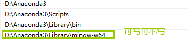   


安装后在 **开始** 菜单栏会看到

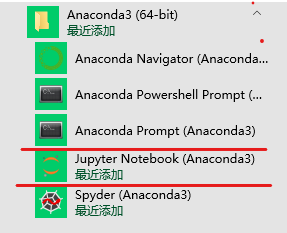  

打开终端，输入**JupyterLab**之后，就可以启动JupyterLab编辑器，启动之后会自动打开浏览器 

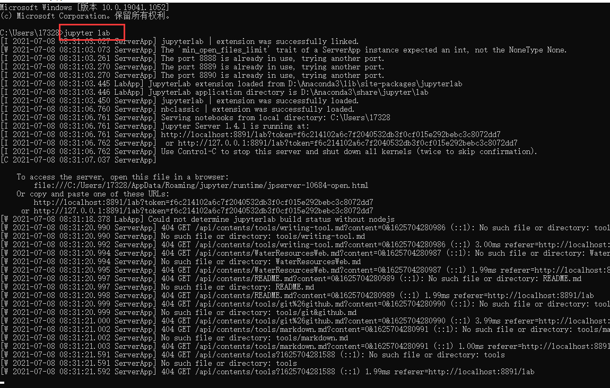   

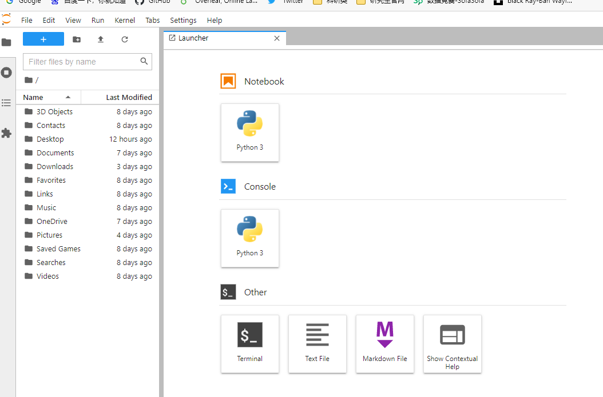  

打开后，会发现它打开的只是一个默认的路径，可能并不是我们想要的，如果想要打开本项目**WaterResources**文件夹，则需在Windows 下找到文件的位置，在该文件夹下打开终端，输入jupyter lab,可以看到打开的是**WaterResources**文件夹下的目录 

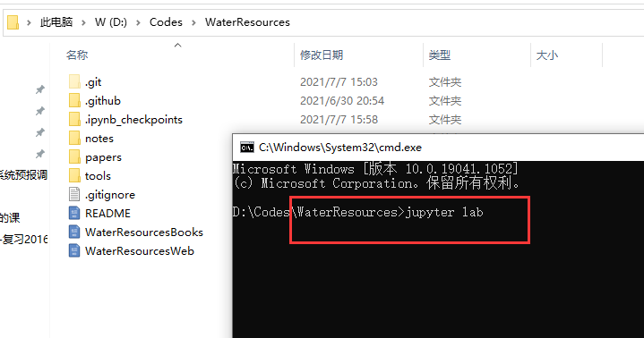   

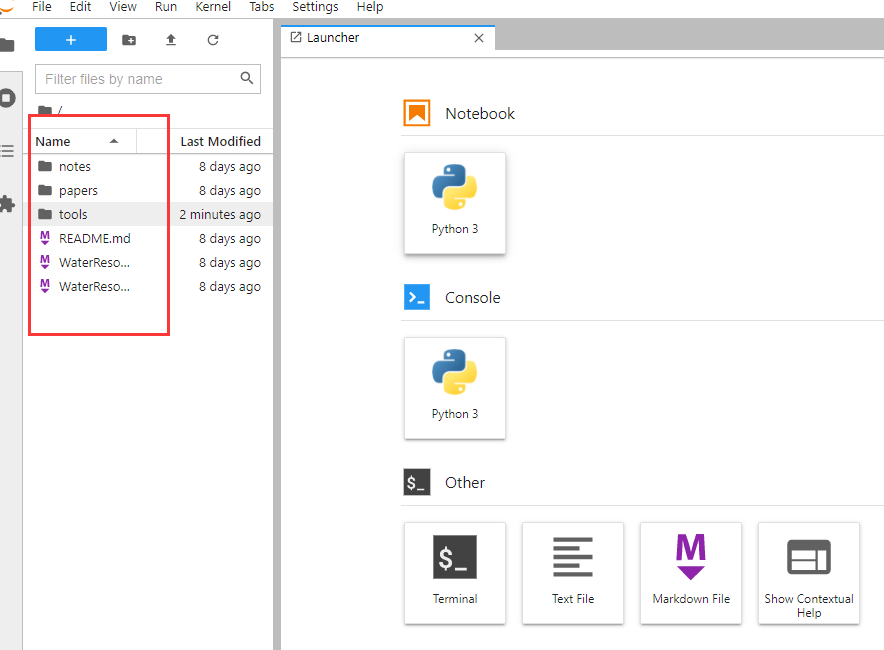     

**注意，如果直接进入cmd，输入jupyter lab，那么进入的还是外边安装的anaconda的jupyter lab**。  
 
所以，我们需要先为**WaterResources**项目（本repo）创建环境，可参考[这里](https://github.com/waterDLut/hydrus/blob/master/1-basic-envir/1-get-started.md) 

在本项目文件夹下打开terminal，输入：

```Shell
conda create --name DUTWR  
```  
根据提示可以看到执行以下语句可进入DUTWR环境：

```Shell
conda activate DUTWR
```

接下来要在DUTWR环境下安装jupyter：  

```Shell
conda install -c conda-forge jupyterlab
```

然后再执行：

```Shell
jupyter lab
```

现在可以在命令行里看到：  

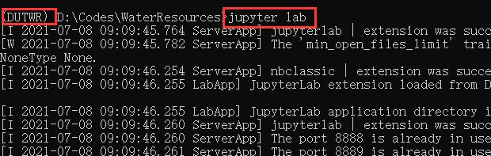 

可以看到启动的jupyter lab是DUTWR环境下的，接下来就可以在jupyter lab中操作了，jupyter lab 导航页面如下所示：

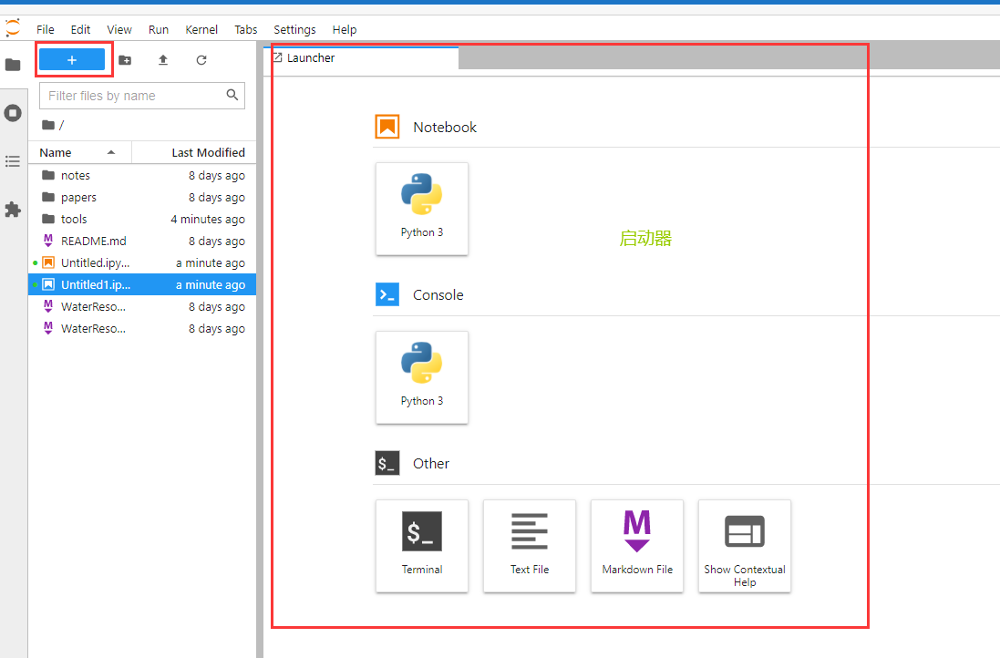 


**如果你想了解关于创建环境的更多细节，可以继续向下看。**

上述创建的DUTWR环境存储在 anaconda3\envs 文件夹下。如果没有指定python环境，那么默认的使用的和安装的anaconda一样的python版本，这里指定使用的是python3.7。要创建一个特定的python版本环境可以使用如下代码：  

```Shell
conda create --name DUTWR python=3.7
```

根据提示可以看到执行以下语句可进入DUTWR环境：

```Shell
conda activate DUTWR
```

如果你没能进入，那可能是terminal环境有点问题，如果你是windows那就重新打开终端试试，    
进入DUTWR环境后，执行以下语句可以退出DUTWR环境。  

```Shell
conda deactivate
```

也可以通过environment.yml文件来创建环境。手动创建文件的方式可以参考：[Creating an environment file manually](https://docs.conda.io/projects/conda/en/latest/user-guide/tasks/manage-environments.html#create-env-file-manually)

示例可直接看本项目的environment.yml文件。可以先删除刚刚创建的虚拟环境：

```Shell
conda remove --name DUTWR --all
```

然后在项目文件夹下执行以下语句就可以创建环境DUTWR了，直接使用下列语句：

```Shell
conda env create -f environment.yml
```

如果更改了environment.yml文件的内容后需要更新环境，则可以运行：

```Shell
conda env update --file environment.yml  --prune
```

--prune参数表示删除不再需要的依赖包。
 
如果需要复制环境，则可以使用：
 
```Shell
conda create --name DUTWR-clone --clone DUTWR
``` 

除了前面说的手动写yml文件，还可以直接使用conda导出。在DUTWR环境下，使用下列代码可以生成新的environment.yml文件：

```Shell
conda env export > environment.yml
```

这里注意一下，当重新在本项目下打开terminal时，输入命令

```Shell
conda env list 
```

可看到 * 在base处，表示处于默认base环境  

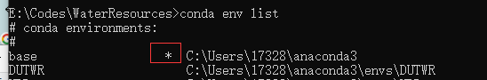   

所以每次打开terminal须先执行下面语句切换到目标环境

```Shell
conda activate DUTWR
```

执行下面语句，可以看到已经处于DUTWR环境下了。

```Shell
conda env list
```

 

### 启动器

右侧的选项卡称为启动器。你可以新建notebook、console、teminal或者text文本。选择Python3，就可以创建一个新的py文件，点击Text File可以创建普通文件，点击Terminal启动控制台。点击Markdown File可以创建md文件。当你创建新的notebook或其他项目时，启动器会消失，此时若您想新建文档，只需单击左侧红框里的“ +”按钮。  

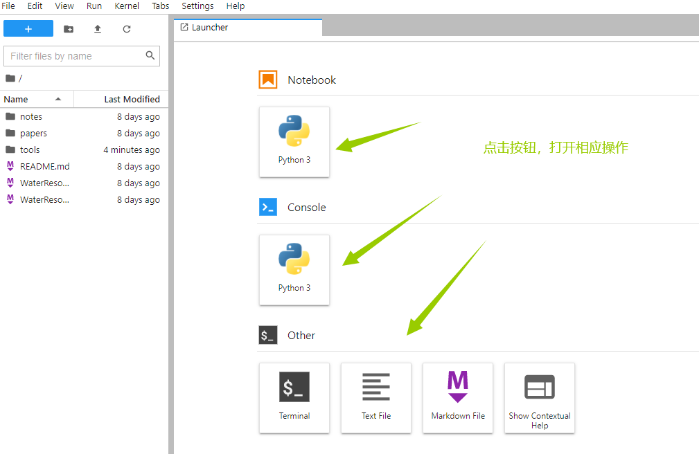

### 打开终端

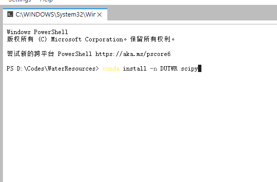  

以下没有特别说明，终端操作都是在jupyter lab中打开的终端上进行，打开一个终端,可以使用代码安装package，输入：

```Shell
conda install -n DUTWR scipy
```

如果需要指定版本，可以使用如下语句：

```Shell
conda install -n DUTWR scipy=0.15.0
```

如果在创建环境时，就指定安装包，可以使用类似如下语句：

```Shell
conda create -n DUTWR python=3.6 scipy=0.15.0 astroid babel
```

### 打开文档

在启动器中点击你想要打开的文档类型，即可以打开相应文档。单击左侧的“ +”按钮，新建多个文档，你会看到 

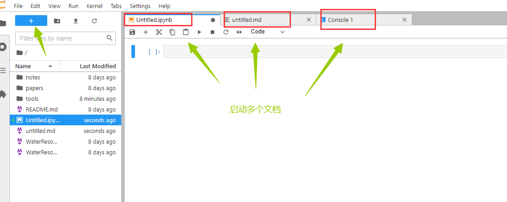

你还可以使用顶部的菜单栏创建新项目，步骤：file->new，然后选择要创建的文档类型。  

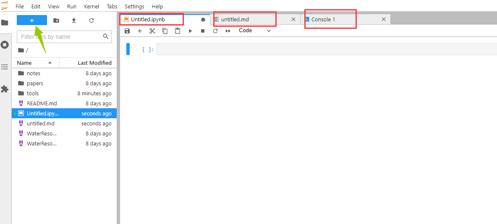  

你可以打开多个文档后，任何排版组合，只需按住选项卡拖移即可。  

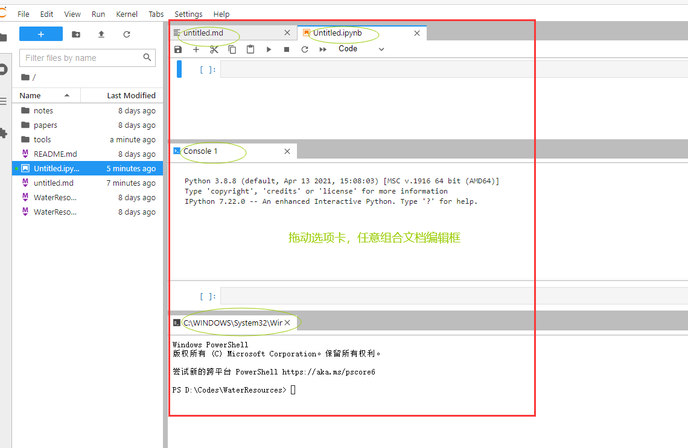  

还可以查看markdown文档的多个视图。步骤：file->new view for Markdown File  

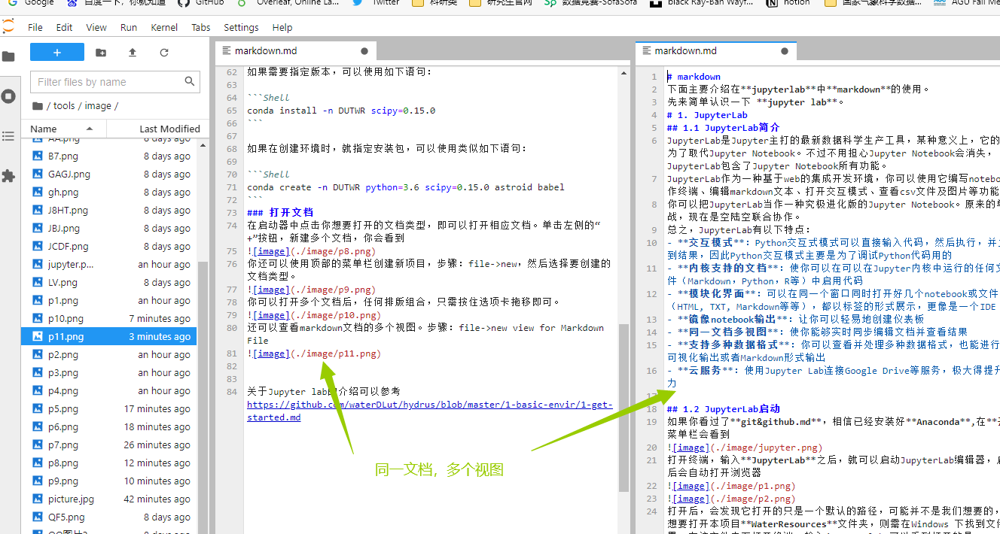   

### 文件浏览器 

左侧一栏是文件浏览器，显示从JupyterLab启动的位置可以使用的文件。

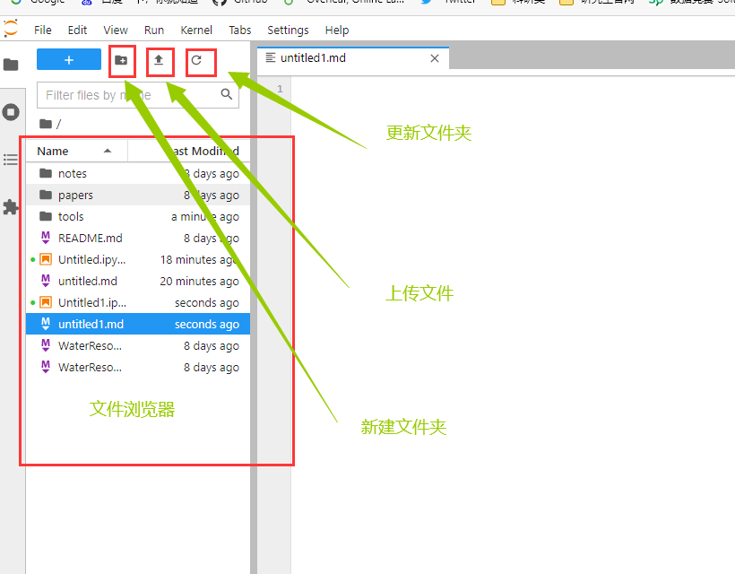

### 切换背景主题

Jupyter Lab支持两种背景主题，白色和黑色。步骤：settings->jupyterlab theme


## 1.3 jupyter文本介绍

不妨点击Python3，就可以打开一个新的页面，进入Python编程环境。  

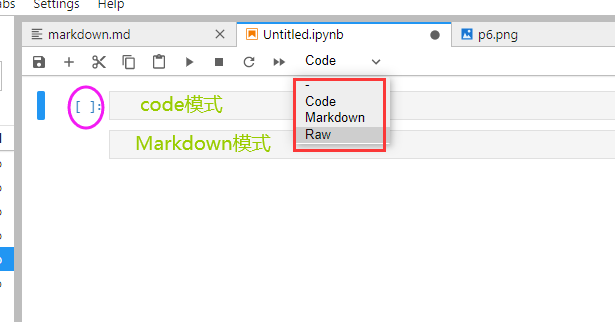

JupyterLab中主要包含两种不同类型的单元格：（Raw不常用）  

- 标记(Markdown)：用来撰写笔记;  

- 代码(Code)：用来运行代码。然后在下方展示运行结果。  

### 两种模式与cell操作

command mode（命令模式）和edit mode（编辑模式）。在一个cell中按下Enter就进入edit mode，按下Esc进入command mode。

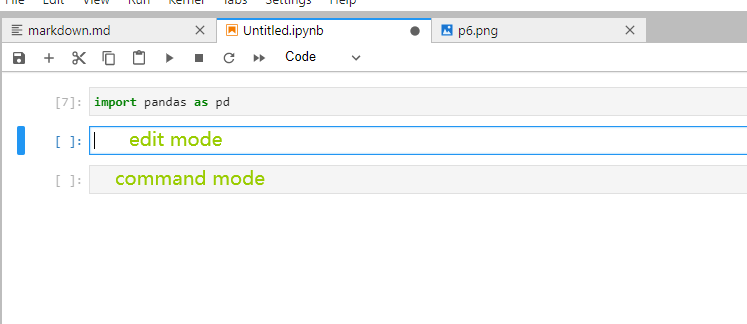  

### 常用快捷键

#### 代码运行键

如需运行一个cell（代码框）内的Python代码，可以选择`Ctrl + Enter`组合键，也可以选择`Shift + Enter`组合键。两者的区别在于前者在运行完代码后不会新增cell，而后者会新增cell或跳转到下一个cell。  

#### 自动补齐键

在代码编写过程中，如果只记得函数或变量名称的前几个字母，可以通过`Tab`键，实现全名称（如函数名、方法名、变量名等）的自动补齐。  

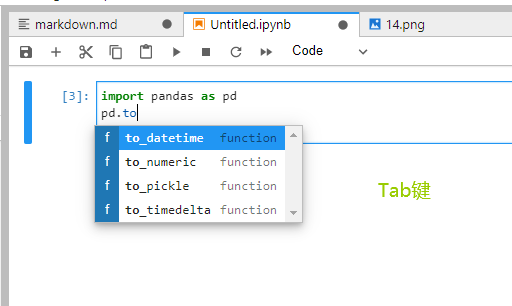

#### 帮助查询键

Python中有庞大的第三方包，而每个包中又包含很多功能性的函数，在使用这些函数时，往往会忘记函数内参数的具体用法，此时可以在函数后面按入`Shift+Tab`组合键，查看对应的帮助文档，而且还可以多按几次`Tab`键，返回不同风格的帮助文档。

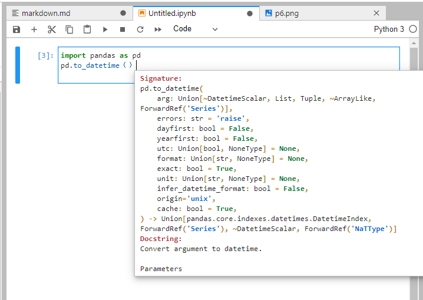

#### cell创建键

在command模式下，按下字母`a`键，则会在当前cell的上方新增一个cell，如果按下字母`b`键，则会在当前cell的下方新增一个cell。

#### cell删除键

在command模式下，连续按两次`d`字母键，就可以轻松删除当前cell。或者还有另一个方法，在command模式下，按一次字母`x`键也可以实现cell的删除。

#### 注释添加/取消键

如需给代码行或代码块增加注释功能，可以使用`Ctrl+/`的组合键，对于代码块的注释需要先选中，在使用组合键。如果原始代码中没有注释符，按入该组合键则增加注释，否则将取消注释 。

#### 保存键

在编写代码时，最好养成良好的习惯，那就是编写代码便保存（尽管Jupyter默认会2分钟自动保存一次，但2分钟内万一出现一些意外，岂不是糟糕啦）。代码的保存可以在command模式下，按一次字母`s`键。

#### 行号显示键

在其他编程环境中也许会显示代码行号，但是在Jupyter的默认情况下是没有代码行号的，如果期望一个cell中显示所有代码对于的行编号，可以在command模式下，按一次字母`l`键。

#### code与markdown间切换键

code指的是Jupyter环境下所进行的Python代码的编写，而markdown则是用于非代码的笔记内容的编写。两者之间是可以轻松切换的，在command模式下，按一次字母`m`便从code切换到markdowen模式；如果从command模式中，按一次字母`y`就可以从markdown模式切换到code模式。

### Jupyter中的魔法函数

#### %pwd

用于显示Jupyter当前的工作空间。

#### %hist

用于显示当前Jupyter中，所有运行过的历史代码。

#### %who

用于显示当前Jupyter环境中的所有变量或名称。

#### %reset

用于删除当前Jupyter环境中的所有变量或名称。

#### %time

用于计算当前代码行的运行时长。

#### %timeit

用于计算当前代码行的平均运行时长（即在执行一个语句100000次(默认情况下)后，再给出运行最快3次的平均值。

#### %%timeit

用于计算当前cell的代码运行时长。

#### %matplotlib

用于显示绘图结果的风格，默认为%matplotlib inline，是直接将图片显示在浏览器中，如果希望图片单独生成，可以使用%matplotlib。

#### %load

用于加载本地Python文件或者网络中的Python文件，例如本地脚本文件的加载：%load xxx.py。

#### %run

用于运行本地或网络中的Python文件，例如本地脚本文件的运行：%load xxx.py。

# 2. Markdown基本使用

如前所述，我们既可以在jupyter文件中创建markdown cell编写markdown文本，也可以新建Markdown文档（后缀名为``.md``）。

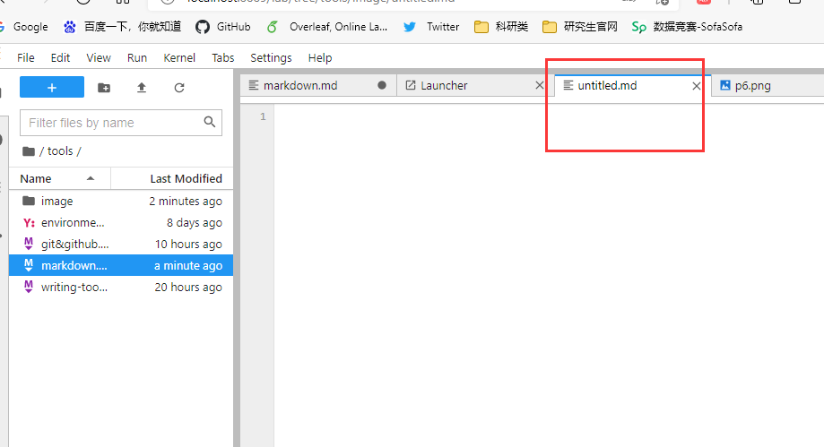

下面就看看如何编写markdown文档，即mardkown常用语法。用到时候查询即可。

## 斜体和粗体

```shell
*斜体*或_斜体_
**粗体**
***加粗斜体***
~~删除线~~
```

显示效果：


## 分级标题

```shell
# 一级标题
## 二级标题
### 三级标题
#### 四级标题
##### 五级标题
###### 六级标题

```
显示效果：

  

也可以这样表示:

```shell
这是一个一级标题
============================


这是一个二级标题
--------------------------------------------------

```

显示效果：


## 更改字体、大小、颜色

```shell
<font face="黑体">我是黑体字</font>  
<font face="微软雅黑">我是微软雅黑</font>  
<font face="STCAIYUN">我是华文彩云</font>  
<font color=red>我是红色</font>  
<font color=#008000>我是绿色</font>  
<font color=Blue>我是蓝色</font>  
<font size=5>我是尺寸</font>  
<font face="黑体" color=green size=5>我是黑体，绿色，尺寸为5</font>  
```  
显示效果：  


附：[RGB颜色名对照表](https://blog.csdn.net/heimu24/article/details/81192697)  

## 为文字添加背景色

由于 style 标签和标签的 style 属性不被支持，所以这里只能是借助 table, tr, td 等表格标签的 bgcolor 属性来实现背景色。故这里对于文字背景色的设置，只是将那一整行看作一个表格，更改了那个格子的背景色（bgcolor）。   

```shell
<table><tr><td bgcolor=yellow>背景色yellow</td></tr></table> 
```  

显示效果：   


## 换行

在一行的末尾添加两个或多个空格，然后按回车键,即可创建一个换行。或者用`<br>`实现换行。  

```shell
This is the first line.  
And this is the second line.  
或者  
his is the first line. <br> And this is the second line.

```

显示效果：  

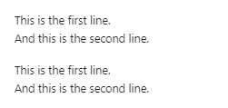

## 超链接

Markdown 支持两种形式的链接语法： 行内式和参考式两种形式，行内式一般使用较多。

### 行内式

**语法说明**：[ ]里写链接文字，()里写链接地址, ()中的“”“中可以为链接指定title属性，title属性可加可不加。**title属性的效果是鼠标悬停在链接上会出现指定的 title文字**。[链接文字](链接地址 “链接标题”)这样的形式。链接地址与链接标题前有一个空格。

```shell
[WaterResources](https://github.com/waterDLut/WaterResources)

[WaterResources](https://github.com/waterDLut/WaterResources "WaterResources")

```
显示效果:


### 参考式

参考式超链接一般用在学术论文上面，或者另一种情况，如果某一个链接在文章中多处使用，那么使用引用 的方式创建链接将非常好，它可以让你对链接进行统一的管理。  
 
**语法说明**：参考式链接分为两部分，文中的写法 [链接文字][链接标记]，在文本的任意位置添加[链接标记]:链接地址 “链接标题”，链接地址与链接标题前有一个空格。     

如果链接文字本身可以做为链接标记，你也可以写成[链接文字][ ]  

[链接文字]：链接地址的形式，见代码的最后一行。  

```shell
我经常浏览[hydrus][1]、[WaterResources][2]  
[WaterResources][2]是一个不错的[repo][]  

[1]:https://github.com/wangmengyun1998/hydrus "hydrus"   
[2]:https://github.com/waterDLut/WaterResources "WaterResources"  
[repo]:https://github.com/waterDLut/WaterResources  
```

显示结果 ：  


### 自动链接

**语法说明**：Markdown 支持以比较简短的自动链接形式来处理网址和电子邮件信箱，只要是用<>包起来， Markdown 就会自动把它转成链接。一般网址的链接文字就和链接地址一样，例如：  

```shell
<wmyun1998@163.com>
```

显示结果：


### 锚点

网页中，锚点其实就是页内超链接，也就是链接本文档内部的某些元素，实现当前页面中的跳转。比如我这里写下一个锚点，点击回到目录，就能跳转到目录。 在目录中点击这一节，就能跳过来。还有下一节的注脚。这些根本上都是用锚点来实现的。    
注意：   
-  Markdown Extra 只支持在标题后插入锚点，其它地方无效。   
-  Leanote 编辑器右侧显示效果区域暂时不支持锚点跳转，所以点来点去发现没有跳转不必惊慌，但是你发布成笔记或博文后是支持跳转的。  

语法描述：   
在你准备跳转到的指定标题后插入锚点{#标记}，然后在文档的其它地方写上连接到锚点的链接。

```shell
[点我跳转到：1.2 JupyterLab启动](#index)


<a id="index">1.2 JupyterLab启动</a>
```

显示效果： 


## 列表

### 无序列表
使用 ``*，+，-`` 表示无序列表。  

```shell
- 无序列表项 一
- 无序列表项 二
 
 
* 无序列表项 一
* 无序列表项 二


+ 无序列表项 一
+ 无序列表项 二
```

显示结果：  


### 有序列表

有序列表则使用数字接着一个英文句点。

 
```shell
1. 有序列表项 一
2. 有序列表项 二
3. 有序列表项 三
```
 
显示结果：  


### 包含引用的列表

**语法说明**：如果要在列表项目内放进引用，那 > 就需要缩进：  

```shell
* 阅读的方法:
    >打开书本。  
    >打开电灯
```
显示结果：    


### 引用 

**语法说明**：引用需要在被引用的文本前加上>符号。  

```shell
 >打开书本。  
 >打开电灯
```
显示结果：  


Markdown 也允许你偷懒只在整个段落的第一行最前面加上 > ：  

```shell
 >打开书本。  
 打开电灯
```
显示结果：  


### 引用的多层嵌套

区块引用可以嵌套（例如：引用内的引用），只要根据层次加上不同数量的 > ：  
```shell
>>>打开书本。  

>>打开电灯。

>阅读
```
显示效果：  


## 任务列表

任务列表使您可以创建带有复选框的项目列表。在支持任务列表的Markdown应用程序中，复选框将显示在内容旁边。  
要创建任务列表，请在任务列表项之前添加破折号`（-）`和方括号，并`[ ]`在其前面加上空格。要选择一个复选框，将x输在方括号`（[x]）` 。 

```shell
- [x] Write the press release
- [ ] Update the website
- [ ] Contact the media
```

显示效果：  


## 插入图像

图片的创建方式与超链接相似，而且和超链接一样也有两种写法，行内式和参考式写法。  

语法中图片Alt的意思是如果图片因为某些原因不能显示，就用定义的图片Alt文字来代替图片。 图片Title则和链接中的Title一样，表示鼠标悬停与图片上时出现的文字。 Alt 和 Title 都不是必须的，可以省略，但建议写上。    
 
### 行内式

**语法说明**：


```shell

```

显示效果：  


### 参考式

**语法说明**：在文档要插入图片的地方写![图片Alt][标记]  

在文档的最后写上[标记]:图片地址 “Title”  (中间空一行)
```shell
![可爱的小孩][boy]

[boy]: ./image/p31.png  "可爱的小孩"
```
显示效果：


## 目录

在段落中填写 `[TOC]` 以显示全文内容的目录结构。

## 代码

插入程序代码的方式有两种，一种是利用缩进(Tab), 另一种是利用符号（一般在ESC键下方）包裹代码。 

**语法说明：**   

- 插入行内代码，即插入一个单词或者一句代码的情况，使用`code`这样的形式插入。

- 插入多行代码，可以使用缩进或者“``` code ```“,具体看示例。 

### 行内式

```
Python语言里的函数 `print()` 怎么使用？
```
显示效果： 


### 缩进式多行代码

缩进 4 个空格或是 1 个制表符     

一个代码区块会一直持续到没有缩进的那一行（或是文件结尾）。    
```
 def copy(c_ctrl, v_ctrl):
        filelist = os.listdir(c_ctrl)     
        if len(filelist) != 0:     
            for file in filelist:
                path11 = os.path.join(c_ctrl, file)
```
显示效果： 

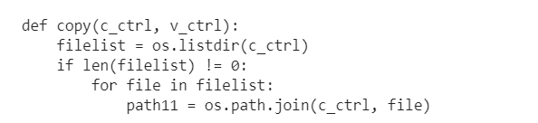  

### 利用符号（一般在ESC键下方）包裹多行代码

```
 def copy(c_ctrl, v_ctrl):
        filelist = os.listdir(c_ctrl)     
        if len(filelist) != 0:     
            for file in filelist:
                path11 = os.path.join(c_ctrl, file)
```
显示效果：  

 

## LaTeX 公式

### 行内公式

```
质能守恒方程可以用一个很简洁的方程式 $E=mc^2$ 来表达。
```
显示效果：  


### 整行公式

```shell
$$\sum_{i=1}^n a_i=0$$
$$\sum^{j-1}_{k=0}{\widehat{\gamma}_{kj} z_k}$$

```
显示效果：

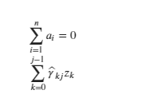

附：[LaTex数学公式大全](https://blog.csdn.net/Mrx_Nh/article/details/73850354)

## 表格

语法说明：  

- 不管是哪种方式，第一行为表头，第二行分隔表头和主体部分，第三行开始每一行为一个表格行。

- 列于列之间用管道符|隔开。原生方式的表格每一行的两边也要有管道符。  

- 第二行还可以为不同的列指定对齐方向。默认为左对齐，在-右边加上:就右对齐。 


```shell
学号|姓名|分数
-|-|-
小明|男|75
小红|女|79
小陆|男|92

```
显示效果：


为表格第二列指定方向：   

```shell
产品|价格
-|-:
Leanote 高级账号|60元/年
Leanote 超级账号|120元/年

```
显示效果：

  

## 分割线

你可以在一行中用三个以上的星号、减号、底线来建立一个分隔线，行内不能有其他东西。你也可以在星号或是减号中间插入空格。下面每种写法都可以建立分隔线：   

```shell
* * *
***
*****
- - -
---------------------------------------
```

显示效果：  


## 流程图 

这里就不展示了，感兴趣可以参考[流程图语法参考](http://flowchart.js.org/)

## 使用 Emoji 表情

哈哈，开心一刻！！！😀  

哈哈，开心一刻！！！😀  

有两种方法可以将表情符号添加到Markdown文件中：将表情符号复制并粘贴到Markdown格式的文本中，或者键入emoji shortcodes。  

### 复制和粘贴表情符号

在大多数情况下，您可以简单地从[Emojipedia](https://emojipedia.org/grinning-face/)等来源复制表情符号并将其粘贴到文档中。许多Markdown应用程序会自动以Markdown格式的文本显示表情符号。从Markdown应用程序导出的HTML和PDF文件应显示表情符号。   

Tip: 如果您使用的是静态网站生成器，请确保将HTML页面编码为UTF-8。  

### 使用表情符号简码

一些Markdown应用程序允许您通过键入表情符号短代码来插入表情符号。这些以冒号开头和结尾，并包含表情符号的名称。   


```shell
给大家演示一个喜怒哀乐:
:happy::angry::frowning::laughing:
```
显示效果：


Note: 注意：您可以使用此[表情符号简码列表](https://gist.github.com/rxaviers/7360908)，但请记住，表情符号简码因应用程序而异。有关更多信息，请参阅Markdown应用程序的文档。  
